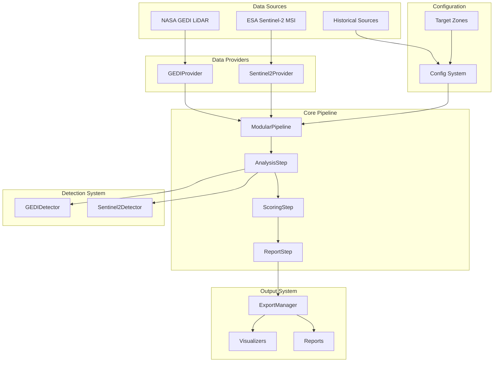
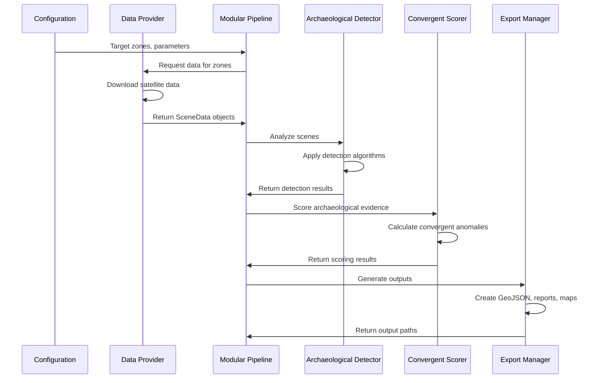
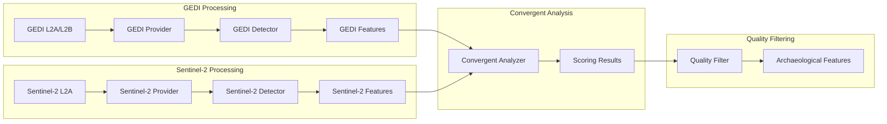

# System Architecture Overview

## Overview

The Amazon Archaeological Discovery Pipeline is a sophisticated, modular system designed for large-scale archaeological site detection in the Amazon rainforest using multi-sensor satellite data analysis. This document provides a comprehensive architectural overview of the system's design, data flows, and integration patterns.

## Architectural Principles

### 1. **Modular Design**
- Independent, interchangeable components
- Clear interfaces between modules
- Pluggable provider and detector architecture
- Separation of concerns across functional areas

### 2. **Multi-Sensor Integration**
- Unified data processing framework
- Provider-agnostic analysis pipeline
- Convergent evidence aggregation
- Cross-sensor validation capabilities

### 3. **Scalable Processing**
- Four-stage pipeline with intermediate persistence
- GPU acceleration with CPU fallback
- Efficient caching and memory management
- Parallel processing support

### 4. **Archaeological Methodology**
- Evidence-based anomaly detection
- Convergent scoring framework
- Literature-validated parameters
- Quality-controlled outputs

---

## High-Level Architecture



---

## Core System Components

### 1. Configuration System (`src/core/config.py`)

**Purpose**: Centralized parameter management and target zone definitions

**Key Components**:
- `TargetZone` definitions with archaeological context
- Provider registration system
- Detection parameter configuration
- API credential management

**Integration Points**:
- All modules import configuration constants
- Environment variable integration
- Validation and default value management

```python
# Configuration flow
TARGET_ZONES → Pipeline → Providers/Detectors → Analysis → Results
```

### 2. Data Provider Framework (`src/providers/`)

**Purpose**: Standardized data acquisition from multiple satellite sources

**Provider Interface**:
```python
class BaseProvider(ABC):
    @abstractmethod
    def download_data(self, zones: List[str], max_scenes: int) -> List[SceneData]
```

**Implemented Providers**:
- **GEDIProvider**: NASA GEDI L2A/L2B space-based LiDAR data
- **Sentinel2Provider**: ESA Sentinel-2 multispectral imagery

**Data Standardization**:
All providers return `SceneData` objects with standardized interfaces, enabling provider-agnostic processing downstream.

### 3. Core Data Objects (`src/core/data_objects.py`)

**Purpose**: Standardized data containers and interfaces

**Primary Classes**:
- **`SceneData`**: Universal satellite scene container
- **`BaseProvider`**: Abstract provider interface
- **`TargetZone`**: Archaeological zone definition

**Data Flow Pattern**:
```
Raw Satellite Data → Provider Processing → SceneData → Pipeline Analysis
```

### 4. Modular Pipeline (`src/pipeline/modular_pipeline.py`)

**Purpose**: Four-stage archaeological analysis orchestration

**Pipeline Stages**:
1. **Data Acquisition**: Download and standardize satellite data
2. **Scene Analysis**: Apply archaeological detectors
3. **Convergent Scoring**: Multi-evidence anomaly detection
4. **Output Generation**: Reports and visualizations

**Stage Independence**: Each stage can accept file paths or in-memory data, enabling flexible execution patterns.

### 5. Detection System (`src/core/detectors/`)

**Purpose**: Archaeological feature detection from satellite data

**Detector Architecture**:
- **GEDIArchaeologicalDetector**: Space-based LiDAR analysis
- **Sentinel2ArchaeologicalDetector**: Multispectral analysis

**Detection Capabilities**:
- Canopy gap analysis (settlement clearings)
- Elevation anomaly detection (earthworks)
- Spectral signature analysis (terra preta)
- Geometric pattern recognition (constructed features)

### 6. Convergent Scoring (`src/core/scoring.py`)

**Purpose**: Multi-evidence archaeological anomaly assessment

**Scoring Framework**:
- Evidence aggregation from multiple sensors
- Weighted scoring based on archaeological research
- Spatial convergence analysis
- Classification into confidence levels

**Evidence Types**:
- Historical documentation (2 points)
- Geometric patterns (3 points each, max 6)
- Terra preta signatures (2 points)
- Environmental suitability (1 point)
- Spatial convergence bonus (0.5-2 points)

### 7. Export and Visualization (`src/pipeline/export_manager.py`)

**Purpose**: Unified output generation with quality filtering

**Export Capabilities**:
- Standards-compliant GeoJSON output
- Multi-sensor feature aggregation
- Top candidate prioritization for field work
- Interactive visualization generation

---

## Data Flow Architecture

### Complete Pipeline Data Flow



### Multi-Sensor Data Integration



---

## Processing Architecture

### Stage-Based Processing Model

#### Stage 1: Data Acquisition
```python
# Input: Zone IDs, scene limits
# Process: Provider-specific data download
# Output: List[SceneData]
# Persistence: JSON serialization of SceneData objects

zones = ["upper_napo_micro"]
scene_data = pipeline.acquire_data(zones, max_scenes=5)
```

#### Stage 2: Scene Analysis
```python
# Input: List[SceneData] or path to saved data
# Process: Provider-specific detector application
# Output: Dict[zone_id, List[analysis_results]]
# Persistence: Analysis results JSON + individual GeoJSON exports

analysis_results = pipeline.analyze_scenes(scene_data)
```

#### Stage 3: Convergent Scoring
```python
# Input: Analysis results or path to saved results
# Process: Multi-evidence aggregation and scoring
# Output: Dict[zone_id, scoring_results]
# Persistence: Scoring results JSON

scoring_results = pipeline.score_zones(analysis_results)
```

#### Stage 4: Output Generation
```python
# Input: Analysis and scoring results
# Process: Report generation and visualization
# Output: Dict with paths to generated files
# Persistence: Reports, maps, unified exports

outputs = pipeline.generate_outputs(analysis_results, scoring_results)
```

### Caching and Persistence Strategy

#### Multi-Level Caching
```
Level 1: In-Memory
├── SceneData objects during pipeline execution
├── Intermediate processing results
└── Configuration and metadata

Level 2: JSON Persistence
├── results/run_{run_id}/scene_data.json
├── results/run_{run_id}/analysis_results.json
├── results/run_{run_id}/scoring_results.json
└── results/run_{run_id}/reports/

Level 3: GeoJSON Exports
├── exports/unified/run_{run_id}/
├── Provider-specific feature exports
└── Combined multi-sensor exports
```

#### Cache Validation
- Content-based validation (file size, modification time)
- Automatic cache invalidation for stale data
- Incremental processing with selective cache updates
- Run-specific isolation prevents cache conflicts

---

## Integration Patterns

### Provider Integration Pattern

```python
# 1. Implement BaseProvider interface
class CustomProvider(BaseProvider):
    def download_data(self, zones: List[str], max_scenes: int) -> List[SceneData]:
        # Custom data acquisition logic
        return scene_data_list

# 2. Register provider in configuration
SATELLITE_PROVIDERS["custom"] = CustomProvider

# 3. Use with pipeline
provider = CustomProvider()
pipeline = ModularPipeline(provider, run_id="custom_001")
```

### Detector Integration Pattern

```python
# 1. Implement detector with standard interface
class CustomDetector:
    def __init__(self, zone, run_id=None):
        self.zone = zone
        self.run_id = run_id
    
    def analyze_scene(self, scene_path):
        # Custom detection algorithms
        return detection_results

# 2. Integration via AnalysisStep
# Detector selection based on SceneData.provider attribute
```

### Configuration Integration Pattern

```python
# 1. Define configuration dataclass
@dataclass
class CustomConfig:
    parameter1: float = 1.0
    parameter2: str = "default"

# 2. Add to config system
def get_custom_config() -> CustomConfig:
    return CustomConfig()

# 3. Use in components
custom_config = get_custom_config()
```

---

## Quality Assurance Architecture

### Validation Framework

#### Input Validation
- **Geographic Bounds**: Validate coordinates within Amazon region
- **Data Completeness**: Ensure required bands/data are available
- **Temporal Constraints**: Validate acquisition dates and seasonal preferences
- **Format Compliance**: Ensure data format compatibility

#### Processing Validation
- **Detection Confidence**: Threshold-based quality filtering
- **Size Constraints**: Archaeological scale validation (100m² - 50km²)
- **Density Limits**: Literature-based site density enforcement
- **Coordinate Accuracy**: Precision and datum validation

#### Output Validation
- **GeoJSON Standards**: CRS and coordinate format compliance
- **Metadata Completeness**: Required properties and descriptions
- **Export Integrity**: File completeness and format validation
- **Cross-Reference Consistency**: Ensure exports match analysis results

### Error Handling Strategy

#### Graceful Degradation
```python
try:
    # Primary processing path
    results = advanced_algorithm(data)
except ImportError:
    # Fallback for missing dependencies
    results = basic_algorithm(data)
except InsufficientDataError:
    # Handle data quality issues
    results = partial_analysis(available_data)
```

#### Error Recovery
- **Provider Fallbacks**: Alternative data sources when primary fails
- **Algorithm Fallbacks**: Simpler algorithms when advanced methods fail
- **Partial Results**: Continue processing with available data
- **Detailed Logging**: Comprehensive error tracking and debugging

---

## Performance Architecture

### Optimization Strategies

#### GPU Acceleration
```python
# Optional CuPy acceleration with automatic fallback
try:
    import cupy as cp
    # GPU-accelerated processing
    gpu_data = cp.asarray(cpu_data)
    results = gpu_algorithm(gpu_data)
    cpu_results = cp.asnumpy(results)
except ImportError:
    # CPU fallback
    cpu_results = cpu_algorithm(cpu_data)
```

#### Memory Management
- **Chunked Processing**: Process large datasets in memory-efficient chunks
- **Lazy Loading**: Load data only when needed
- **Memory Monitoring**: Track and limit memory usage
- **Garbage Collection**: Explicit cleanup of large objects

#### Parallel Processing
- **Multi-Processing**: Parallel scene analysis across CPU cores
- **Scene-Level Parallelism**: Independent processing of satellite scenes
- **Zone-Level Parallelism**: Concurrent analysis of geographic zones
- **I/O Optimization**: Asynchronous file operations

### Scalability Considerations

#### Horizontal Scaling
- **Scene Independence**: Scenes can be processed on different machines
- **Zone Partitioning**: Large zones can be subdivided for processing
- **Provider Separation**: Different sensors can be processed independently
- **Result Aggregation**: Distributed results can be combined post-processing

#### Vertical Scaling
- **Memory Scaling**: Support for 8GB to 64GB+ memory configurations
- **GPU Scaling**: Automatic detection and utilization of available GPUs
- **CPU Scaling**: Configurable worker processes based on CPU cores
- **Storage Scaling**: Automatic directory management and cleanup

---

## Security and Privacy Architecture

### Data Security
- **Credential Management**: Secure API key storage and environment variable integration
- **Network Security**: HTTPS-only data transfers for satellite data access
- **Local Storage**: Encrypted cache storage for sensitive intermediate results
- **Access Control**: File permission management for shared processing environments

### Privacy Considerations
- **Indigenous Rights**: Respect for indigenous territory and cultural heritage
- **Data Anonymization**: Geographic coordinates rounded to appropriate precision
- **Selective Disclosure**: Configurable detail levels for sensitive archaeological sites
- **Research Ethics**: Compliance with archaeological research ethics standards

---

## Extension Points

### Adding New Data Providers

1. **Implement BaseProvider Interface**
2. **Register in SATELLITE_PROVIDERS**
3. **Create Provider-Specific Detector**
4. **Update Configuration Classes**
5. **Add Provider-Specific Tests**

### Adding New Detection Algorithms

1. **Create Detector Class with Standard Interface**
2. **Integrate with AnalysisStep**
3. **Add Configuration Parameters**
4. **Update Scoring Framework**
5. **Create Documentation and Tests**

### Adding New Export Formats

1. **Extend UnifiedExportManager**
2. **Add Format-Specific Methods**
3. **Update Configuration Options**
4. **Ensure Quality Validation**
5. **Add Format Documentation**

### Adding New Visualization Types

1. **Create Visualizer Class**
2. **Integrate with ReportStep**
3. **Add Visualization Configuration**
4. **Ensure Cross-Platform Compatibility**
5. **Create Usage Examples**

---

## Deployment Architecture

### Development Environment
```
Local Machine
├── Python 3.8+ environment
├── Required dependencies (numpy, geopandas, etc.)
├── Optional GPU acceleration (CuPy)
├── NASA Earthdata credentials
└── OpenAI API key (for AI features)
```

### Production Environment
```
Production Server
├── High-memory configuration (16GB+ recommended)
├── GPU acceleration (CUDA-capable)
├── High-speed storage (SSD preferred)
├── Network access to satellite data APIs
└── Backup and monitoring systems
```

### Cloud Deployment
```
Cloud Infrastructure
├── Compute instances with GPU support
├── Object storage for data caching
├── Container orchestration (Docker/Kubernetes)
├── API credential management
└── Result storage and distribution
```

This system architecture enables robust, scalable archaeological discovery workflows while maintaining scientific rigor and quality control throughout the analysis pipeline.