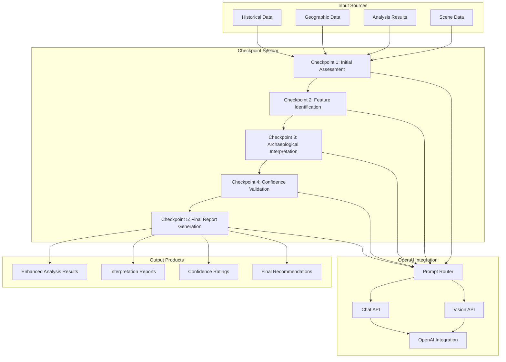

# OpenAI Integration and Checkpoint System

## Overview

The OpenAI Integration and Checkpoint System provides AI-enhanced archaeological interpretation capabilities for the Amazon Archaeological Discovery Pipeline. This system implements a sophisticated 5-stage checkpoint framework that combines traditional remote sensing analysis with large language model capabilities for enhanced archaeological site interpretation and validation.

## Architecture

### Core Design Principles

1. **AI-Enhanced Analysis**: Combines computer vision with natural language processing for archaeological interpretation
2. **Checkpoint-Based Workflow**: 5-stage progressive analysis with intermediate validation
3. **Multi-Modal Integration**: Text, image, and geospatial data processing
4. **Competition Compliance**: SAAM (Space-based Archaeological Analysis and Mapping) framework compliance
5. **Prompt Optimization**: Advanced prompt engineering for archaeological context

### System Components



## Core Classes and Components

### `OpenAICheckpointRunner` Class

#### Primary Orchestrator

```python
class OpenAICheckpointRunner:
    def __init__(self, api_key: str = None):
        """Initialize OpenAI checkpoint runner with API integration.
        
        Args:
            api_key: OpenAI API key (optional, can use environment variable)
        """
        self.api_key = api_key or os.getenv('OPENAI_API_KEY')
        if not self.api_key:
            raise ValueError("OpenAI API key required for checkpoint system")
        
        # Initialize OpenAI client
        self.client = openai.OpenAI(api_key=self.api_key)
        
        # Initialize checkpoint modules
        self.checkpoints = {
            1: Checkpoint1(),
            2: Checkpoint2(),
            3: Checkpoint3(),
            4: Checkpoint4(),
            5: Checkpoint5()
        }
        
        # Initialize prompt router
        self.prompt_router = PromptRouter()
```

#### Checkpoint Execution Framework

```python
def run_checkpoint(self, checkpoint_num: int, input_data: Dict[str, Any]) -> Dict[str, Any]:
    """Execute a specific checkpoint with OpenAI integration.
    
    Args:
        checkpoint_num: Checkpoint number (1-5)
        input_data: Input data including analysis results and context
        
    Returns:
        Enhanced analysis results with AI interpretation
    """
    if checkpoint_num not in self.checkpoints:
        raise ValueError(f"Invalid checkpoint number: {checkpoint_num}")
    
    checkpoint = self.checkpoints[checkpoint_num]
    
    # Prepare checkpoint-specific prompt
    prompt = self.prompt_router.generate_prompt(checkpoint_num, input_data)
    
    # Execute checkpoint with OpenAI
    try:
        if hasattr(checkpoint, 'requires_vision') and checkpoint.requires_vision:
            response = self._execute_vision_checkpoint(checkpoint, prompt, input_data)
        else:
            response = self._execute_text_checkpoint(checkpoint, prompt, input_data)
        
        # Validate and process response
        processed_response = checkpoint.process_response(response, input_data)
        
        return {
            "checkpoint": checkpoint_num,
            "success": True,
            "analysis": processed_response,
            "prompt_used": prompt,
            "timestamp": datetime.now().isoformat()
        }
        
    except Exception as e:
        logger.error(f"Checkpoint {checkpoint_num} execution failed: {e}")
        return {
            "checkpoint": checkpoint_num,
            "success": False,
            "error": str(e),
            "timestamp": datetime.now().isoformat()
        }

def run_all_checkpoints(self, input_data: Dict[str, Any]) -> Dict[str, Any]:
    """Execute complete 5-checkpoint analysis pipeline.
    
    Args:
        input_data: Complete analysis context including scene data and results
        
    Returns:
        Comprehensive AI-enhanced archaeological assessment
    """
    checkpoint_results = {}
    current_data = input_data.copy()
    
    # Execute checkpoints sequentially
    for checkpoint_num in range(1, 6):
        logger.info(f"Executing Checkpoint {checkpoint_num}")
        
        result = self.run_checkpoint(checkpoint_num, current_data)
        checkpoint_results[f"checkpoint_{checkpoint_num}"] = result
        
        # Update data context for next checkpoint
        if result["success"]:
            current_data[f"checkpoint_{checkpoint_num}_results"] = result["analysis"]
        else:
            logger.warning(f"Checkpoint {checkpoint_num} failed, continuing with available data")
    
    # Generate final consolidated report
    final_report = self._generate_final_report(checkpoint_results, input_data)
    
    return {
        "checkpoint_results": checkpoint_results,
        "final_report": final_report,
        "execution_summary": self._generate_execution_summary(checkpoint_results)
    }
```

### `PromptRouter` Class

#### Intelligent Prompt Management

```python
class PromptRouter:
    def __init__(self):
        """Initialize prompt router with archaeological expertise."""
        self.prompt_templates = self._load_prompt_templates()
        self.archaeological_context = self._load_archaeological_context()
    
    def generate_prompt(self, checkpoint_num: int, input_data: Dict[str, Any]) -> str:
        """Generate checkpoint-specific prompt with archaeological context.
        
        Args:
            checkpoint_num: Target checkpoint (1-5)
            input_data: Analysis data and context
            
        Returns:
            Optimized prompt for archaeological analysis
        """
        base_template = self.prompt_templates[f"checkpoint_{checkpoint_num}"]
        
        # Extract relevant data for prompt
        analysis_results = input_data.get("analysis_results", {})
        zone_info = input_data.get("zone_info", {})
        detection_summary = self._summarize_detections(analysis_results)
        
        # Build context-aware prompt
        prompt = base_template.format(
            zone_name=zone_info.get("name", "Unknown Zone"),
            zone_context=zone_info.get("historical_evidence", "Limited historical documentation"),
            detection_summary=detection_summary,
            archaeological_context=self.archaeological_context,
            previous_checkpoints=self._get_previous_checkpoint_summary(input_data)
        )
        
        return prompt

    def _load_prompt_templates(self) -> Dict[str, str]:
        """Load checkpoint-specific prompt templates."""
        return {
            "checkpoint_1": """
            You are an expert space-based archaeologist analyzing satellite data for potential archaeological sites in the Amazon rainforest.

            ## Analysis Context
            **Zone**: {zone_name}
            **Historical Context**: {zone_context}
            
            ## Detection Summary
            {detection_summary}
            
            ## Archaeological Context
            {archaeological_context}
            
            ## Task: Initial Archaeological Assessment
            
            Based on the satellite detection data provided, conduct an initial assessment of the archaeological potential for this zone. Consider:
            
            1. **Detection Pattern Analysis**: How do the detected features align with known archaeological signatures?
            2. **Environmental Context**: Is the location suitable for pre-Columbian settlement?
            3. **Feature Distribution**: Do the spatial patterns suggest human organization?
            4. **Confidence Assessment**: Rate the overall archaeological potential (0-100)
            
            Provide a structured analysis focusing on archaeological interpretation rather than technical details.
            """,
            
            "checkpoint_2": """
            You are conducting detailed feature identification for potential archaeological sites detected via satellite analysis.

            ## Analysis Context
            **Zone**: {zone_name}
            **Historical Context**: {zone_context}
            
            ## Detection Data
            {detection_summary}
            
            ## Previous Analysis
            {previous_checkpoints}
            
            ## Task: Detailed Feature Identification
            
            Analyze each detected feature type for archaeological significance:
            
            1. **Clearings Analysis**: 
               - Size and shape patterns
               - Potential settlement organization
               - Relationship to environmental features
            
            2. **Earthwork Analysis**:
               - Mound configurations and purposes
               - Linear feature interpretations
               - Construction complexity assessment
            
            3. **Spatial Relationships**:
               - Inter-feature connections
               - Site hierarchy indicators
               - Landscape integration patterns
            
            4. **Cultural Interpretation**:
               - Likely cultural affiliation
               - Functional site categories
               - Chronological considerations
            
            Provide specific archaeological interpretations for each feature category.
            """,
            
            "checkpoint_3": """
            You are providing comprehensive archaeological interpretation of detected features in the Amazon rainforest.

            ## Analysis Context
            **Zone**: {zone_name}
            **Historical Context**: {zone_context}
            
            ## Detection Summary
            {detection_summary}
            
            ## Previous Analysis
            {previous_checkpoints}
            
            ## Task: Archaeological Site Interpretation
            
            Provide a comprehensive archaeological interpretation considering:
            
            1. **Settlement Pattern Analysis**:
               - Site hierarchy and organization
               - Relationship to water sources and transport routes
               - Evidence for planned vs. organic development
            
            2. **Cultural Landscape Assessment**:
               - Integration with natural environment
               - Evidence for landscape modification
               - Sustainable land use indicators
            
            3. **Chronological Framework**:
               - Likely occupation periods
               - Relationship to known archaeological sequences
               - Evidence for continuity or abandonment
            
            4. **Functional Interpretation**:
               - Residential vs. ceremonial areas
               - Agricultural and subsistence indicators
               - Craft production evidence
            
            5. **Regional Significance**:
               - Connections to broader cultural networks
               - Unique or representative characteristics
               - Research priority assessment
            
            Synthesize findings into a coherent archaeological narrative.
            """,
            
            "checkpoint_4": """
            You are validating archaeological interpretations and assessing confidence levels for satellite-detected features.

            ## Analysis Context
            **Zone**: {zone_name}
            **Historical Context**: {zone_context}
            
            ## Detection Summary
            {detection_summary}
            
            ## Previous Analysis
            {previous_checkpoints}
            
            ## Task: Confidence Validation and Risk Assessment
            
            Critically evaluate the archaeological interpretations:
            
            1. **Evidence Strength Assessment**:
               - Quality of satellite detection data
               - Consistency across multiple sensors
               - Alignment with archaeological expectations
            
            2. **Alternative Interpretations**:
               - Natural formation possibilities
               - Modern disturbance factors
               - Geological or environmental explanations
            
            3. **Confidence Calibration**:
               - High confidence features (>80%)
               - Medium confidence features (50-80%)
               - Low confidence features (<50%)
            
            4. **Validation Requirements**:
               - Ground-truthing priorities
               - Additional remote sensing needs
               - Comparative analysis opportunities
            
            5. **Risk Assessment**:
               - False positive likelihood
               - Preservation status concerns
               - Access and investigation challenges
            
            Provide calibrated confidence scores and validation recommendations.
            """,
            
            "checkpoint_5": """
            You are generating the final comprehensive archaeological assessment report for satellite-detected features.

            ## Analysis Context
            **Zone**: {zone_name}
            **Historical Context**: {zone_context}
            
            ## Complete Analysis Chain
            {previous_checkpoints}
            
            ## Task: Final Archaeological Report
            
            Synthesize all previous checkpoints into a comprehensive final report:
            
            1. **Executive Summary**:
               - Key archaeological findings
               - Significance assessment
               - Immediate recommendations
            
            2. **Site Descriptions**:
               - Detailed feature characterizations
               - Spatial organization patterns
               - Cultural interpretations
            
            3. **Research Priorities**:
               - High-priority investigation targets
               - Recommended methodologies
               - Timeline considerations
            
            4. **Conservation Implications**:
               - Threat assessments
               - Protection recommendations
               - Monitoring requirements
            
            5. **Scientific Contributions**:
               - Advancement of archaeological knowledge
               - Methodological innovations
               - Regional research integration
            
            6. **Next Steps**:
               - Field verification priorities
               - Additional analysis requirements
               - Collaboration opportunities
            
            Create a professional archaeological report suitable for academic and conservation audiences.
            """
        }

    def _load_archaeological_context(self) -> str:
        """Load comprehensive archaeological context for the Amazon region."""
        return """
        ## Amazon Archaeological Context
        
        The Amazon rainforest contains extensive evidence of pre-Columbian civilizations, including:
        
        **Settlement Patterns**:
        - Terra preta (anthropogenic dark earth) sites indicating intensive agriculture
        - Geometric earthworks (geoglyphs) revealing complex landscape engineering
        - Ring villages and plaza complexes showing social organization
        - Linear causeway networks connecting settlements
        
        **Chronological Framework**:
        - Early settlements: 10,000+ years ago
        - Intensive occupation: 2,000-500 years ago
        - Complex societies: 1,000-500 years ago
        - European contact impacts: 500 years ago to present
        
        **Archaeological Signatures**:
        - Canopy gaps from clearings and settlements
        - Elevated areas from platform mounds and terra preta
        - Linear features from causeways and field boundaries
        - Geometric patterns from planned settlements and ceremonial areas
        
        **Detection Challenges**:
        - Dense forest canopy obscuring surface features
        - Rapid vegetation regrowth masking archaeological sites
        - Limited accessibility for ground verification
        - Complex natural vs. cultural pattern differentiation
        """
```

## Individual Checkpoint Classes

### Checkpoint 1: Initial Assessment

```python
class Checkpoint1:
    """Initial archaeological assessment of detected features."""
    
    def __init__(self):
        self.name = "Initial Archaeological Assessment"
        self.requires_vision = False
    
    def process_response(self, response: str, input_data: Dict[str, Any]) -> Dict[str, Any]:
        """Process OpenAI response for initial assessment."""
        
        # Extract confidence score from response
        confidence_score = self._extract_confidence_score(response)
        
        # Categorize archaeological potential
        if confidence_score >= 80:
            potential_category = "high"
        elif confidence_score >= 50:
            potential_category = "medium"
        else:
            potential_category = "low"
        
        # Extract key assessment points
        assessment_points = self._extract_assessment_points(response)
        
        return {
            "assessment_type": "initial_archaeological_assessment",
            "confidence_score": confidence_score,
            "potential_category": potential_category,
            "assessment_points": assessment_points,
            "full_analysis": response,
            "recommendations": self._generate_initial_recommendations(confidence_score)
        }
    
    def _extract_confidence_score(self, response: str) -> int:
        """Extract confidence score from response text."""
        import re
        
        # Look for confidence patterns
        patterns = [
            r'confidence.*?(\d+)%',
            r'(\d+)%.*?confidence',
            r'potential.*?(\d+)%',
            r'(\d+).*?out of 100'
        ]
        
        for pattern in patterns:
            match = re.search(pattern, response, re.IGNORECASE)
            if match:
                return int(match.group(1))
        
        # Default confidence based on response tone
        if "high" in response.lower() and "potential" in response.lower():
            return 75
        elif "medium" in response.lower() or "moderate" in response.lower():
            return 60
        elif "low" in response.lower():
            return 35
        else:
            return 50  # Neutral default
    
    def _extract_assessment_points(self, response: str) -> List[str]:
        """Extract key assessment points from response."""
        
        # Split response into sentences and identify key points
        sentences = response.split('.')
        key_points = []
        
        keywords = [
            'archaeological', 'settlement', 'clearings', 'earthworks', 
            'features', 'patterns', 'evidence', 'potential', 'significance'
        ]
        
        for sentence in sentences:
            if any(keyword in sentence.lower() for keyword in keywords):
                clean_sentence = sentence.strip()
                if len(clean_sentence) > 20:  # Avoid very short fragments
                    key_points.append(clean_sentence)
        
        return key_points[:5]  # Return top 5 points
    
    def _generate_initial_recommendations(self, confidence_score: int) -> List[str]:
        """Generate initial recommendations based on confidence score."""
        
        if confidence_score >= 80:
            return [
                "Prioritize for detailed multi-sensor analysis",
                "Schedule high-resolution satellite follow-up",
                "Prepare for ground verification expedition",
                "Coordinate with local archaeological authorities"
            ]
        elif confidence_score >= 50:
            return [
                "Conduct additional remote sensing analysis",
                "Compare with regional archaeological patterns",
                "Assess accessibility for future investigation",
                "Monitor for preservation status changes"
            ]
        else:
            return [
                "Continue monitoring with regular satellite passes",
                "Compare against natural formation databases",
                "Consider alternative interpretation methods",
                "Maintain in long-term observation catalog"
            ]
```

### Checkpoint 2: Feature Identification

```python
class Checkpoint2:
    """Detailed archaeological feature identification and classification."""
    
    def __init__(self):
        self.name = "Detailed Feature Identification"
        self.requires_vision = False
    
    def process_response(self, response: str, input_data: Dict[str, Any]) -> Dict[str, Any]:
        """Process feature identification response."""
        
        # Extract feature classifications
        feature_classifications = self._extract_feature_classifications(response)
        
        # Assess spatial relationships
        spatial_analysis = self._extract_spatial_analysis(response)
        
        # Determine cultural interpretations
        cultural_interpretations = self._extract_cultural_interpretations(response)
        
        return {
            "analysis_type": "detailed_feature_identification",
            "feature_classifications": feature_classifications,
            "spatial_analysis": spatial_analysis,
            "cultural_interpretations": cultural_interpretations,
            "full_analysis": response,
            "feature_confidence": self._calculate_feature_confidence(feature_classifications)
        }
    
    def _extract_feature_classifications(self, response: str) -> Dict[str, Any]:
        """Extract archaeological feature classifications."""
        
        classifications = {
            "clearings": [],
            "earthworks": [],
            "linear_features": [],
            "complex_features": []
        }
        
        # Parse response for feature types and descriptions
        lines = response.split('\n')
        current_category = None
        
        for line in lines:
            line = line.strip()
            
            # Identify category headers
            if 'clearing' in line.lower():
                current_category = 'clearings'
            elif 'earthwork' in line.lower() or 'mound' in line.lower():
                current_category = 'earthworks'
            elif 'linear' in line.lower() or 'causeway' in line.lower():
                current_category = 'linear_features'
            elif 'complex' in line.lower():
                current_category = 'complex_features'
            
            # Extract feature descriptions
            if current_category and len(line) > 20:
                if any(word in line.lower() for word in ['settlement', 'village', 'site', 'feature']):
                    classifications[current_category].append(line)
        
        return classifications
    
    def _extract_spatial_analysis(self, response: str) -> Dict[str, Any]:
        """Extract spatial relationship analysis."""
        
        spatial_keywords = {
            'clustered': 'clustered_pattern',
            'linear': 'linear_arrangement',
            'dispersed': 'dispersed_pattern',
            'hierarchical': 'hierarchical_organization',
            'connected': 'connected_features',
            'isolated': 'isolated_features'
        }
        
        detected_patterns = []
        for keyword, pattern_type in spatial_keywords.items():
            if keyword in response.lower():
                detected_patterns.append(pattern_type)
        
        return {
            "spatial_patterns": detected_patterns,
            "organization_type": self._determine_organization_type(detected_patterns),
            "connectivity_assessment": "connected" if "connected" in detected_patterns else "isolated"
        }
    
    def _extract_cultural_interpretations(self, response: str) -> Dict[str, Any]:
        """Extract cultural and functional interpretations."""
        
        cultural_indicators = {
            'residential': ['house', 'dwelling', 'residential', 'habitation'],
            'ceremonial': ['ceremonial', 'ritual', 'sacred', 'plaza'],
            'agricultural': ['agricultural', 'farming', 'cultivation', 'terra preta'],
            'defensive': ['defensive', 'fortification', 'protection', 'strategic'],
            'administrative': ['administrative', 'elite', 'central', 'complex']
        }
        
        interpretations = {}
        for category, indicators in cultural_indicators.items():
            if any(indicator in response.lower() for indicator in indicators):
                interpretations[category] = True
        
        return interpretations
    
    def _calculate_feature_confidence(self, classifications: Dict[str, Any]) -> float:
        """Calculate overall feature identification confidence."""
        
        total_features = sum(len(features) for features in classifications.values())
        
        if total_features == 0:
            return 0.0
        elif total_features >= 10:
            return 0.9
        elif total_features >= 5:
            return 0.8
        elif total_features >= 3:
            return 0.7
        else:
            return 0.6
```

### Checkpoint 3: Archaeological Interpretation

```python
class Checkpoint3:
    """Comprehensive archaeological site interpretation."""
    
    def __init__(self):
        self.name = "Archaeological Site Interpretation"
        self.requires_vision = False
    
    def process_response(self, response: str, input_data: Dict[str, Any]) -> Dict[str, Any]:
        """Process archaeological interpretation response."""
        
        # Extract settlement pattern analysis
        settlement_patterns = self._extract_settlement_patterns(response)
        
        # Extract cultural landscape assessment
        landscape_assessment = self._extract_landscape_assessment(response)
        
        # Extract chronological framework
        chronological_framework = self._extract_chronological_framework(response)
        
        # Extract functional interpretation
        functional_interpretation = self._extract_functional_interpretation(response)
        
        # Assess regional significance
        regional_significance = self._assess_regional_significance(response)
        
        return {
            "analysis_type": "archaeological_site_interpretation",
            "settlement_patterns": settlement_patterns,
            "landscape_assessment": landscape_assessment,
            "chronological_framework": chronological_framework,
            "functional_interpretation": functional_interpretation,
            "regional_significance": regional_significance,
            "full_analysis": response,
            "interpretation_confidence": self._calculate_interpretation_confidence(response)
        }
    
    def _extract_settlement_patterns(self, response: str) -> Dict[str, Any]:
        """Extract settlement pattern analysis."""
        
        pattern_indicators = {
            'nucleated': ['nucleated', 'clustered', 'concentrated', 'village'],
            'dispersed': ['dispersed', 'scattered', 'distributed'],
            'linear': ['linear', 'riverine', 'along', 'following'],
            'hierarchical': ['hierarchical', 'ranked', 'central', 'secondary'],
            'planned': ['planned', 'organized', 'geometric', 'regular']
        }
        
        detected_patterns = {}
        for pattern, indicators in pattern_indicators.items():
            if any(indicator in response.lower() for indicator in indicators):
                detected_patterns[pattern] = True
        
        return {
            "pattern_types": list(detected_patterns.keys()),
            "organization_level": "high" if "planned" in detected_patterns else "medium" if "hierarchical" in detected_patterns else "low",
            "water_relationship": "riverine" if "linear" in detected_patterns else "inland"
        }
    
    def _extract_landscape_assessment(self, response: str) -> Dict[str, Any]:
        """Extract cultural landscape assessment."""
        
        landscape_keywords = {
            'modified': ['modified', 'altered', 'transformed', 'engineered'],
            'integrated': ['integrated', 'adapted', 'harmonized'],
            'sustainable': ['sustainable', 'management', 'conservation'],
            'intensive': ['intensive', 'extensive', 'large-scale']
        }
        
        landscape_features = {}
        for feature, keywords in landscape_keywords.items():
            if any(keyword in response.lower() for keyword in keywords):
                landscape_features[feature] = True
        
        return landscape_features
    
    def _extract_chronological_framework(self, response: str) -> Dict[str, Any]:
        """Extract chronological assessment."""
        
        chronological_indicators = {
            'pre_columbian': ['pre-columbian', 'pre-contact', 'indigenous', 'ancient'],
            'late_period': ['late', 'recent', '500', 'contact'],
            'early_period': ['early', 'archaic', '1000', 'formative'],
            'multi_component': ['multiple', 'phases', 'reoccupation', 'continuous']
        }
        
        chronological_assessment = {}
        for period, indicators in chronological_indicators.items():
            if any(indicator in response.lower() for indicator in indicators):
                chronological_assessment[period] = True
        
        return chronological_assessment
    
    def _extract_functional_interpretation(self, response: str) -> Dict[str, Any]:
        """Extract functional site interpretation."""
        
        functional_categories = {
            'residential': ['residential', 'domestic', 'household', 'habitation'],
            'ceremonial': ['ceremonial', 'ritual', 'religious', 'sacred'],
            'agricultural': ['agricultural', 'farming', 'cultivation', 'subsistence'],
            'craft_production': ['craft', 'production', 'workshop', 'manufacturing'],
            'administrative': ['administrative', 'elite', 'leadership', 'political']
        }
        
        functional_assessment = {}
        for function, keywords in functional_categories.items():
            if any(keyword in response.lower() for keyword in keywords):
                functional_assessment[function] = True
        
        return functional_assessment
    
    def _assess_regional_significance(self, response: str) -> Dict[str, Any]:
        """Assess regional significance of the site."""
        
        significance_indicators = {
            'unique': ['unique', 'rare', 'exceptional', 'unprecedented'],
            'representative': ['typical', 'representative', 'characteristic'],
            'important': ['important', 'significant', 'major', 'key'],
            'connected': ['connected', 'network', 'trade', 'interaction']
        }
        
        significance_assessment = {}
        for indicator, keywords in significance_indicators.items():
            if any(keyword in response.lower() for keyword in keywords):
                significance_assessment[indicator] = True
        
        # Calculate overall significance score
        significance_score = len(significance_assessment) * 25  # 0-100 scale
        
        return {
            "significance_indicators": significance_assessment,
            "significance_score": min(significance_score, 100),
            "research_priority": "high" if significance_score >= 75 else "medium" if significance_score >= 50 else "low"
        }
    
    def _calculate_interpretation_confidence(self, response: str) -> float:
        """Calculate interpretation confidence based on response detail."""
        
        # Count interpretation elements
        interpretation_elements = [
            'settlement', 'landscape', 'chronological', 'functional', 'cultural',
            'pattern', 'organization', 'significance', 'context', 'evidence'
        ]
        
        element_count = sum(1 for element in interpretation_elements if element in response.lower())
        
        # Calculate confidence based on comprehensiveness
        base_confidence = min(element_count / len(interpretation_elements), 1.0)
        
        # Adjust for response length (more detailed = higher confidence)
        length_factor = min(len(response) / 2000, 1.0)  # Normalize to 2000 characters
        
        return (base_confidence * 0.7) + (length_factor * 0.3)
```

### Checkpoint 4: Confidence Validation

```python
class Checkpoint4:
    """Confidence validation and risk assessment."""
    
    def __init__(self):
        self.name = "Confidence Validation and Risk Assessment"
        self.requires_vision = False
    
    def process_response(self, response: str, input_data: Dict[str, Any]) -> Dict[str, Any]:
        """Process confidence validation response."""
        
        # Extract evidence strength assessment
        evidence_assessment = self._extract_evidence_assessment(response)
        
        # Extract alternative interpretations
        alternative_interpretations = self._extract_alternative_interpretations(response)
        
        # Extract confidence calibration
        confidence_calibration = self._extract_confidence_calibration(response)
        
        # Extract validation requirements
        validation_requirements = self._extract_validation_requirements(response)
        
        # Extract risk assessment
        risk_assessment = self._extract_risk_assessment(response)
        
        return {
            "analysis_type": "confidence_validation",
            "evidence_assessment": evidence_assessment,
            "alternative_interpretations": alternative_interpretations,
            "confidence_calibration": confidence_calibration,
            "validation_requirements": validation_requirements,
            "risk_assessment": risk_assessment,
            "full_analysis": response,
            "overall_confidence": self._calculate_overall_confidence(confidence_calibration)
        }
    
    def _extract_evidence_assessment(self, response: str) -> Dict[str, Any]:
        """Extract evidence strength assessment."""
        
        strength_indicators = {
            'strong': ['strong', 'robust', 'convincing', 'compelling'],
            'moderate': ['moderate', 'reasonable', 'adequate'],
            'weak': ['weak', 'limited', 'insufficient', 'unclear']
        }
        
        evidence_strength = {}
        for strength, indicators in strength_indicators.items():
            if any(indicator in response.lower() for indicator in indicators):
                evidence_strength[strength] = True
        
        # Determine overall evidence quality
        if 'strong' in evidence_strength:
            quality = 'high'
        elif 'moderate' in evidence_strength:
            quality = 'medium'
        else:
            quality = 'low'
        
        return {
            "evidence_quality": quality,
            "strength_indicators": evidence_strength,
            "data_consistency": "high" if "consistent" in response.lower() else "variable"
        }
    
    def _extract_alternative_interpretations(self, response: str) -> List[str]:
        """Extract alternative interpretation considerations."""
        
        alternative_keywords = [
            'natural', 'geological', 'environmental', 'modern', 'recent',
            'erosion', 'deposition', 'disturbance', 'agricultural'
        ]
        
        alternatives = []
        sentences = response.split('.')
        
        for sentence in sentences:
            if any(keyword in sentence.lower() for keyword in alternative_keywords):
                if 'alternative' in sentence.lower() or 'natural' in sentence.lower():
                    alternatives.append(sentence.strip())
        
        return alternatives[:3]  # Return top 3 alternatives
    
    def _extract_confidence_calibration(self, response: str) -> Dict[str, Any]:
        """Extract confidence calibration information."""
        
        import re
        
        # Look for confidence levels in response
        confidence_patterns = [
            r'high confidence.*?(\d+)%',
            r'medium confidence.*?(\d+)%',
            r'low confidence.*?(\d+)%',
            r'(\d+)%.*?confidence'
        ]
        
        confidence_levels = {'high': [], 'medium': [], 'low': []}
        
        # Extract confidence mentions
        if 'high confidence' in response.lower():
            confidence_levels['high'].append('archaeological interpretation')
        if 'medium confidence' in response.lower():
            confidence_levels['medium'].append('feature identification')
        if 'low confidence' in response.lower():
            confidence_levels['low'].append('specific details')
        
        # Calculate average confidence
        total_features = sum(len(features) for features in confidence_levels.values())
        
        if confidence_levels['high']:
            avg_confidence = 85
        elif confidence_levels['medium']:
            avg_confidence = 65
        else:
            avg_confidence = 45
        
        return {
            "confidence_levels": confidence_levels,
            "average_confidence": avg_confidence,
            "calibration_notes": self._extract_calibration_notes(response)
        }
    
    def _extract_validation_requirements(self, response: str) -> Dict[str, Any]:
        """Extract validation requirements and recommendations."""
        
        validation_types = {
            'ground_truthing': ['ground', 'field', 'excavation', 'survey'],
            'additional_sensing': ['satellite', 'remote sensing', 'lidar', 'radar'],
            'comparative_analysis': ['comparative', 'regional', 'database', 'similar'],
            'expert_consultation': ['expert', 'specialist', 'archaeologist', 'consultation']
        }
        
        required_validation = {}
        for validation_type, keywords in validation_types.items():
            if any(keyword in response.lower() for keyword in keywords):
                required_validation[validation_type] = True
        
        # Extract priority recommendations
        priority_indicators = ['priority', 'urgent', 'immediate', 'critical']
        high_priority = any(indicator in response.lower() for indicator in priority_indicators)
        
        return {
            "required_validation": required_validation,
            "validation_priority": "high" if high_priority else "medium",
            "timeline_urgency": "immediate" if "immediate" in response.lower() else "planned"
        }
    
    def _extract_risk_assessment(self, response: str) -> Dict[str, Any]:
        """Extract risk assessment information."""
        
        risk_factors = {
            'false_positive': ['false positive', 'misidentification', 'natural formation'],
            'preservation': ['preservation', 'deterioration', 'threat', 'damage'],
            'access': ['access', 'remote', 'difficult', 'inaccessible'],
            'interpretation': ['interpretation', 'uncertainty', 'ambiguous']
        }
        
        identified_risks = {}
        for risk_type, indicators in risk_factors.items():
            if any(indicator in response.lower() for indicator in indicators):
                identified_risks[risk_type] = True
        
        # Calculate overall risk level
        risk_count = len(identified_risks)
        if risk_count >= 3:
            risk_level = 'high'
        elif risk_count >= 2:
            risk_level = 'medium'
        else:
            risk_level = 'low'
        
        return {
            "identified_risks": identified_risks,
            "overall_risk_level": risk_level,
            "mitigation_requirements": list(identified_risks.keys())
        }
    
    def _calculate_overall_confidence(self, confidence_calibration: Dict[str, Any]) -> float:
        """Calculate overall confidence score."""
        
        return confidence_calibration.get("average_confidence", 50) / 100.0
    
    def _extract_calibration_notes(self, response: str) -> List[str]:
        """Extract calibration notes and considerations."""
        
        note_keywords = ['consider', 'note', 'important', 'caution', 'limitation']
        notes = []
        
        sentences = response.split('.')
        for sentence in sentences:
            if any(keyword in sentence.lower() for keyword in note_keywords):
                notes.append(sentence.strip())
        
        return notes[:3]  # Return top 3 notes
```

### Checkpoint 5: Final Report Generation

```python
class Checkpoint5:
    """Final comprehensive archaeological assessment report."""
    
    def __init__(self):
        self.name = "Final Archaeological Report"
        self.requires_vision = False
    
    def process_response(self, response: str, input_data: Dict[str, Any]) -> Dict[str, Any]:
        """Process final report response."""
        
        # Extract executive summary
        executive_summary = self._extract_executive_summary(response)
        
        # Extract site descriptions
        site_descriptions = self._extract_site_descriptions(response)
        
        # Extract research priorities
        research_priorities = self._extract_research_priorities(response)
        
        # Extract conservation implications
        conservation_implications = self._extract_conservation_implications(response)
        
        # Extract scientific contributions
        scientific_contributions = self._extract_scientific_contributions(response)
        
        # Extract next steps
        next_steps = self._extract_next_steps(response)
        
        return {
            "report_type": "final_archaeological_assessment",
            "executive_summary": executive_summary,
            "site_descriptions": site_descriptions,
            "research_priorities": research_priorities,
            "conservation_implications": conservation_implications,
            "scientific_contributions": scientific_contributions,
            "next_steps": next_steps,
            "full_report": response,
            "report_quality": self._assess_report_quality(response)
        }
    
    def _extract_executive_summary(self, response: str) -> Dict[str, Any]:
        """Extract executive summary components."""
        
        # Look for summary section
        summary_section = self._extract_section(response, "executive summary", "summary")
        
        if not summary_section:
            # Create summary from key points in response
            summary_section = response[:500] + "..." if len(response) > 500 else response
        
        # Extract key findings
        key_findings = self._extract_key_findings(summary_section)
        
        # Extract significance assessment
        significance = self._extract_significance_level(summary_section)
        
        # Extract recommendations
        recommendations = self._extract_summary_recommendations(summary_section)
        
        return {
            "summary_text": summary_section,
            "key_findings": key_findings,
            "significance_level": significance,
            "immediate_recommendations": recommendations
        }
    
    def _extract_section(self, response: str, *section_names: str) -> str:
        """Extract specific section from response."""
        
        response_lower = response.lower()
        
        for section_name in section_names:
            # Look for section headers
            section_start = response_lower.find(section_name)
            if section_start != -1:
                # Find next section or end of response
                remaining_text = response[section_start:]
                next_section = float('inf')
                
                # Look for next major section
                for next_header in ['##', '**', 'conclusions', 'recommendations', 'next steps']:
                    next_pos = remaining_text.lower().find(next_header, 50)  # Skip current header
                    if next_pos != -1:
                        next_section = min(next_section, next_pos)
                
                if next_section == float('inf'):
                    return remaining_text
                else:
                    return remaining_text[:next_section]
        
        return ""
    
    def _extract_key_findings(self, text: str) -> List[str]:
        """Extract key findings from text."""
        
        findings_keywords = [
            'archaeological', 'settlement', 'evidence', 'features', 'discovery',
            'significant', 'important', 'identified', 'detected', 'indicates'
        ]
        
        sentences = text.split('.')
        key_findings = []
        
        for sentence in sentences:
            if any(keyword in sentence.lower() for keyword in findings_keywords):
                finding = sentence.strip()
                if len(finding) > 20:
                    key_findings.append(finding)
        
        return key_findings[:5]  # Return top 5 findings
    
    def _extract_significance_level(self, text: str) -> str:
        """Extract significance level assessment."""
        
        high_significance = ['exceptional', 'unique', 'major', 'significant', 'important']
        medium_significance = ['moderate', 'notable', 'interesting', 'relevant']
        low_significance = ['limited', 'minor', 'small', 'local']
        
        text_lower = text.lower()
        
        if any(word in text_lower for word in high_significance):
            return "high"
        elif any(word in text_lower for word in medium_significance):
            return "medium"
        elif any(word in text_lower for word in low_significance):
            return "low"
        else:
            return "unknown"
    
    def _extract_summary_recommendations(self, text: str) -> List[str]:
        """Extract summary recommendations."""
        
        recommendation_keywords = [
            'recommend', 'suggest', 'propose', 'should', 'priority',
            'investigate', 'explore', 'examine', 'verify'
        ]
        
        sentences = text.split('.')
        recommendations = []
        
        for sentence in sentences:
            if any(keyword in sentence.lower() for keyword in recommendation_keywords):
                rec = sentence.strip()
                if len(rec) > 15:
                    recommendations.append(rec)
        
        return recommendations[:3]  # Return top 3 recommendations
    
    def _assess_report_quality(self, response: str) -> Dict[str, Any]:
        """Assess overall report quality."""
        
        quality_indicators = {
            'comprehensiveness': len(response) >= 2000,
            'structured': any(header in response.lower() for header in ['summary', 'description', 'priority', 'conservation']),
            'scientific': any(term in response.lower() for term in ['analysis', 'evidence', 'methodology', 'assessment']),
            'actionable': any(term in response.lower() for term in ['recommend', 'next steps', 'priority', 'timeline'])
        }
        
        quality_score = sum(quality_indicators.values()) / len(quality_indicators)
        
        if quality_score >= 0.8:
            quality_level = "excellent"
        elif quality_score >= 0.6:
            quality_level = "good"
        elif quality_score >= 0.4:
            quality_level = "adequate"
        else:
            quality_level = "needs_improvement"
        
        return {
            "quality_indicators": quality_indicators,
            "quality_score": quality_score,
            "quality_level": quality_level,
            "report_length": len(response)
        }
```

## OpenAI API Integration

### Vision API Integration

```python
def _execute_vision_checkpoint(self, checkpoint, prompt: str, input_data: Dict[str, Any]) -> str:
    """Execute checkpoint with vision API for image analysis."""
    
    # Prepare image data
    image_data = input_data.get("image_data", [])
    if not image_data:
        raise ValueError("Vision checkpoint requires image data")
    
    # Prepare vision messages
    messages = [
        {
            "role": "system",
            "content": "You are an expert archaeological analyst specializing in satellite image interpretation for archaeological site detection."
        },
        {
            "role": "user",
            "content": [
                {"type": "text", "text": prompt},
                *[{"type": "image_url", "image_url": {"url": img}} for img in image_data]
            ]
        }
    ]
    
    # Execute vision API call
    try:
        response = self.client.chat.completions.create(
            model="gpt-4-vision-preview",
            messages=messages,
            max_tokens=2000,
            temperature=0.3  # Lower temperature for archaeological analysis
        )
        
        return response.choices[0].message.content
        
    except Exception as e:
        logger.error(f"Vision API call failed: {e}")
        raise

def _execute_text_checkpoint(self, checkpoint, prompt: str, input_data: Dict[str, Any]) -> str:
    """Execute checkpoint with text completion API."""
    
    messages = [
        {
            "role": "system",
            "content": "You are an expert space-based archaeologist with decades of experience in Amazon rainforest archaeological research and satellite data interpretation."
        },
        {
            "role": "user",
            "content": prompt
        }
    ]
    
    try:
        response = self.client.chat.completions.create(
            model="gpt-4",
            messages=messages,
            max_tokens=3000,
            temperature=0.2,  # Low temperature for consistent archaeological analysis
            presence_penalty=0.1,
            frequency_penalty=0.1
        )
        
        return response.choices[0].message.content
        
    except Exception as e:
        logger.error(f"Text API call failed: {e}")
        raise
```

## Integration with Main Pipeline

### Pipeline Integration

```python
def integrate_with_pipeline(analysis_results: Dict[str, Any], 
                          scoring_results: Dict[str, Any]) -> Dict[str, Any]:
    """Integrate OpenAI checkpoint system with main pipeline."""
    
    # Initialize checkpoint runner
    checkpoint_runner = OpenAICheckpointRunner()
    
    enhanced_results = {}
    
    for zone_id, zone_analyses in analysis_results.items():
        logger.info(f"Running OpenAI enhancement for zone: {zone_id}")
        
        # Prepare input data for checkpoints
        input_data = {
            "zone_info": TARGET_ZONES.get(zone_id, {}),
            "analysis_results": zone_analyses,
            "scoring_results": scoring_results.get(zone_id, {}),
            "detection_summary": _summarize_detections_for_ai(zone_analyses)
        }
        
        # Run complete checkpoint sequence
        try:
            checkpoint_results = checkpoint_runner.run_all_checkpoints(input_data)
            
            enhanced_results[zone_id] = {
                "original_analysis": zone_analyses,
                "ai_enhancement": checkpoint_results,
                "integration_timestamp": datetime.now().isoformat()
            }
            
        except Exception as e:
            logger.error(f"OpenAI enhancement failed for zone {zone_id}: {e}")
            enhanced_results[zone_id] = {
                "original_analysis": zone_analyses,
                "ai_enhancement": {"error": str(e)},
                "integration_timestamp": datetime.now().isoformat()
            }
    
    return enhanced_results

def _summarize_detections_for_ai(zone_analyses: List[Dict]) -> str:
    """Summarize detection results for AI processing."""
    
    total_features = 0
    provider_summary = {}
    
    for analysis in zone_analyses:
        provider = analysis.get("provider", "unknown")
        features = analysis.get("total_features", 0)
        total_features += features
        
        if provider not in provider_summary:
            provider_summary[provider] = {"analyses": 0, "features": 0}
        
        provider_summary[provider]["analyses"] += 1
        provider_summary[provider]["features"] += features
    
    summary = f"Total detected features: {total_features}\n"
    summary += f"Provider breakdown:\n"
    
    for provider, stats in provider_summary.items():
        summary += f"- {provider}: {stats['features']} features from {stats['analyses']} analyses\n"
    
    return summary
```

## Usage Examples

### Basic Checkpoint Execution

```python
from src.core.openai_integration import OpenAICheckpointRunner

# Initialize checkpoint runner
runner = OpenAICheckpointRunner(api_key="your-openai-api-key")

# Prepare input data
input_data = {
    "zone_info": TARGET_ZONES["upper_napo_micro"],
    "analysis_results": analysis_results,
    "detection_summary": "45 archaeological features detected across GEDI and Sentinel-2 data"
}

# Run single checkpoint
checkpoint_1_result = runner.run_checkpoint(1, input_data)
print(f"Initial assessment confidence: {checkpoint_1_result['analysis']['confidence_score']}%")

# Run complete checkpoint sequence
full_results = runner.run_all_checkpoints(input_data)
print(f"Final archaeological assessment: {full_results['final_report']['executive_summary']}")
```

### Pipeline Integration

```python
# Integrate with complete pipeline
from src.pipeline.modular_pipeline import ModularPipeline

# Standard pipeline execution
pipeline = ModularPipeline(provider, run_id="ai_enhanced_001")
standard_results = pipeline.run(zones=["upper_napo_micro"])

# AI enhancement
enhanced_results = integrate_with_pipeline(
    standard_results["analysis_results"],
    standard_results["scoring_results"]
)

# Combined results
final_results = {
    **standard_results,
    "ai_enhancement": enhanced_results,
    "integration_type": "openai_checkpoint_system"
}
```

The OpenAI Integration and Checkpoint System provides sophisticated AI-enhanced archaeological interpretation capabilities, transforming raw satellite detection data into comprehensive archaeological assessments suitable for academic research and field investigation planning.