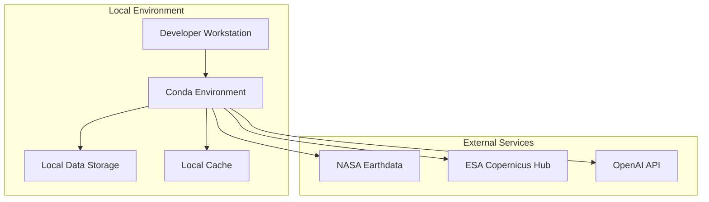
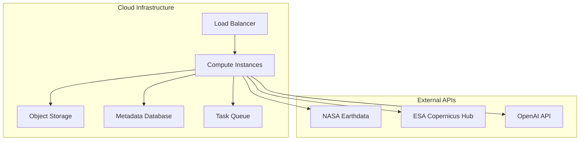
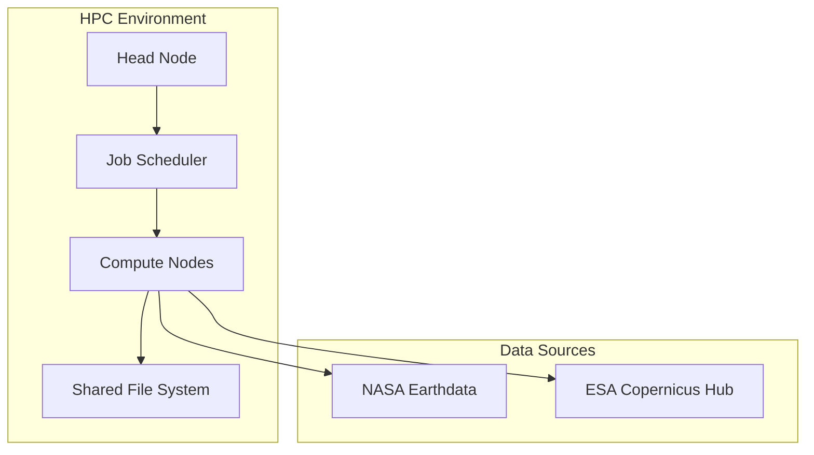

# Deployment Guide

## Overview

This guide provides comprehensive instructions for deploying the Amazon Archaeological Discovery Pipeline in production environments. The system is designed for flexible deployment across various computational environments, from local workstations to cloud-based high-performance computing clusters.

## Deployment Architectures

### 1. Local Development Deployment

**Use Case**: Development, testing, and small-scale analysis



### 2. Cloud Deployment (AWS/GCP/Azure)

**Use Case**: Large-scale processing, distributed analysis



### 3. HPC Cluster Deployment

**Use Case**: High-throughput archaeological surveys



## Prerequisites

### System Requirements

#### Minimum Requirements
- **CPU**: 4 cores, 2.5GHz+
- **RAM**: 16GB (32GB recommended)
- **Storage**: 500GB available space
- **OS**: Linux (Ubuntu 20.04+), macOS 10.15+, Windows 10+ with WSL2

#### Recommended Requirements
- **CPU**: 8+ cores, 3.0GHz+
- **RAM**: 64GB+
- **Storage**: 2TB+ SSD storage
- **GPU**: NVIDIA GPU with 8GB+ VRAM (optional, for optimization)
- **Network**: High-bandwidth internet connection for data downloads

### Software Dependencies

#### Core Dependencies
```bash
# Python 3.8+ with conda package manager
conda create -n amazon python=3.9
conda activate amazon

# Geospatial libraries
conda install -c conda-forge gdal rasterio geopandas shapely folium

# Scientific computing
conda install numpy scipy pandas matplotlib seaborn plotly

# Machine learning and computer vision
pip install scikit-learn opencv-python

# Satellite data processing
pip install sentinelsat earthaccess

# Optional: GPU acceleration
conda install -c conda-forge cupy  # If NVIDIA GPU available
```

#### API Access Requirements
1. **NASA Earthdata Account** (Required for GEDI data)
2. **ESA Copernicus Account** (Optional, for Sentinel-2 backup)
3. **OpenAI API Key** (Required for AI integration features)

## Installation

### 1. Repository Setup

```bash
# Clone repository
git clone https://github.com/your-org/amazon-discovery.git
cd amazon-discovery

# Create and activate environment
conda create -n amazon python=3.9
conda activate amazon

# Install dependencies
pip install -r requirements.txt

# Install package in development mode
pip install -e .
```

### 2. Environment Configuration

#### Create Configuration Files

```bash
# Copy example configuration
cp config/config.example.yaml config/config.yaml
cp .env.example .env
```

#### Configure Environment Variables

```bash
# Edit .env file
nano .env
```

**Required Environment Variables**:
```bash
# NASA Earthdata Credentials
EARTHDATA_USERNAME=your_nasa_username
EARTHDATA_PASSWORD=your_nasa_password

# OpenAI API (for enhanced features)
OPENAI_API_KEY=your_openai_api_key

# Optional: ESA Copernicus Credentials
COPERNICUS_USERNAME=your_esa_username
COPERNICUS_PASSWORD=your_esa_password

# Data directories
DATA_DIR=/path/to/data/storage
RESULTS_DIR=/path/to/results/storage
CACHE_DIR=/path/to/cache/storage

# Performance settings
MAX_WORKERS=4
ENABLE_GPU=false
```

### 3. Authentication Setup

#### NASA Earthdata Authentication

```bash
# Install earthaccess for NASA authentication
pip install earthaccess

# Configure NASA credentials
python -c "
import earthaccess
earthaccess.login(persist=True)
"
```

#### OpenAI Authentication

```bash
# Test OpenAI connection
python -c "
import openai
import os
openai.api_key = os.getenv('OPENAI_API_KEY')
print('OpenAI authentication successful')
"
```

### 4. Verification Installation

```bash
# Run installation verification
python -m src.core.validation --verify-installation

# Test basic pipeline functionality
python main.py --list-zones

# Run minimal analysis test
python main.py --pipeline --zone upper_napo_micro --max-scenes 1
```

## Local Deployment

### Development Environment Setup

```bash
# Create development directories
mkdir -p data/{raw,processed,cache}
mkdir -p results/{exports,reports,maps}
mkdir -p logs

# Set up development configuration
export DATA_DIR=$(pwd)/data
export RESULTS_DIR=$(pwd)/results
export CACHE_DIR=$(pwd)/data/cache

# Configure logging
export LOG_LEVEL=INFO
export LOG_FILE=$(pwd)/logs/pipeline.log
```

### Running the Pipeline Locally

```bash
# Activate environment
conda activate amazon

# Run complete pipeline
python main.py --pipeline --zone upper_napo_micro

# Run specific stages
python main.py --pipeline --stage acquire_data
python main.py --pipeline --stage analyze_scenes
python main.py --pipeline --stage score_zones
python main.py --pipeline --stage generate_outputs

# Run OpenAI checkpoints
python main.py --checkpoint 1
python main.py --all-checkpoints
```

### Local Performance Optimization

```bash
# Enable multiprocessing
export MAX_WORKERS=8

# Use local SSD for cache
export CACHE_DIR=/path/to/fast/ssd/cache

# Enable GPU acceleration (if available)
export ENABLE_GPU=true

# Optimize memory usage
export MEMORY_LIMIT=32GB
```

## Cloud Deployment

### AWS Deployment

#### Infrastructure Setup

```yaml
# deploy/aws/infrastructure.yaml
Resources:
  ComputeCluster:
    Type: AWS::ECS::Cluster
    Properties:
      ClusterName: archaeology-pipeline
      
  TaskDefinition:
    Type: AWS::ECS::TaskDefinition
    Properties:
      Family: archaeology-task
      Cpu: 4096
      Memory: 16384
      RequiresCompatibilities:
        - FARGATE
      NetworkMode: awsvpc
      ContainerDefinitions:
        - Name: pipeline-container
          Image: your-repo/archaeology-pipeline:latest
          Environment:
            - Name: DATA_DIR
              Value: /mnt/data
            - Name: RESULTS_DIR
              Value: /mnt/results
```

#### Docker Configuration

```dockerfile
# Dockerfile
FROM continuumio/miniconda3:latest

# Install system dependencies
RUN apt-get update && apt-get install -y \
    gdal-bin \
    libgdal-dev \
    build-essential \
    && rm -rf /var/lib/apt/lists/*

# Create conda environment
COPY environment.yaml .
RUN conda env create -f environment.yaml

# Activate environment
SHELL ["conda", "run", "-n", "amazon", "/bin/bash", "-c"]

# Copy application
COPY . /app
WORKDIR /app

# Install package
RUN pip install -e .

# Set entrypoint
ENTRYPOINT ["conda", "run", "-n", "amazon", "python", "main.py"]
```

#### Deployment Commands

```bash
# Build and push Docker image
docker build -t your-repo/archaeology-pipeline:latest .
docker push your-repo/archaeology-pipeline:latest

# Deploy infrastructure
aws cloudformation deploy \
  --template-file deploy/aws/infrastructure.yaml \
  --stack-name archaeology-pipeline \
  --capabilities CAPABILITY_IAM

# Run pipeline task
aws ecs run-task \
  --cluster archaeology-pipeline \
  --task-definition archaeology-task \
  --launch-type FARGATE \
  --network-configuration "awsvpcConfiguration={subnets=[subnet-xxx],securityGroups=[sg-xxx],assignPublicIp=ENABLED}"
```

### Google Cloud Platform Deployment

#### Cloud Run Configuration

```yaml
# deploy/gcp/cloudrun.yaml
apiVersion: serving.knative.dev/v1
kind: Service
metadata:
  name: archaeology-pipeline
spec:
  template:
    metadata:
      annotations:
        autoscaling.knative.dev/maxScale: "10"
        run.googleapis.com/memory: "16Gi"
        run.googleapis.com/cpu: "4"
    spec:
      containers:
      - image: gcr.io/your-project/archaeology-pipeline:latest
        env:
        - name: DATA_DIR
          value: "/mnt/data"
        - name: RESULTS_DIR
          value: "/mnt/results"
        volumeMounts:
        - name: data-volume
          mountPath: /mnt/data
        resources:
          limits:
            memory: "16Gi"
            cpu: "4"
```

#### Deployment Script

```bash
#!/bin/bash
# deploy/gcp/deploy.sh

# Build and push image
gcloud builds submit --tag gcr.io/your-project/archaeology-pipeline:latest

# Deploy to Cloud Run
gcloud run deploy archaeology-pipeline \
  --image gcr.io/your-project/archaeology-pipeline:latest \
  --platform managed \
  --region us-central1 \
  --memory 16Gi \
  --cpu 4 \
  --timeout 3600 \
  --max-instances 10
```

## HPC Cluster Deployment

### SLURM Configuration

#### Job Script Template

```bash
#!/bin/bash
# deploy/hpc/pipeline-job.sh

#SBATCH --job-name=archaeology-pipeline
#SBATCH --nodes=1
#SBATCH --ntasks-per-node=16
#SBATCH --memory=128GB
#SBATCH --time=24:00:00
#SBATCH --partition=compute
#SBATCH --output=logs/pipeline-%j.out
#SBATCH --error=logs/pipeline-%j.err

# Load modules
module load python/3.9
module load gdal/3.4
module load gcc/9.3

# Activate conda environment
source activate amazon

# Set environment variables
export DATA_DIR=$SCRATCH/archaeology-data
export RESULTS_DIR=$SCRATCH/archaeology-results
export MAX_WORKERS=16
export OMP_NUM_THREADS=16

# Create directories
mkdir -p $DATA_DIR $RESULTS_DIR/run_$SLURM_JOB_ID

# Run pipeline
python main.py --pipeline --zone upper_napo_micro --run-id $SLURM_JOB_ID
```

#### Array Job for Multiple Zones

```bash
#!/bin/bash
# deploy/hpc/array-job.sh

#SBATCH --job-name=archaeology-array
#SBATCH --array=1-10
#SBATCH --nodes=1
#SBATCH --ntasks-per-node=8
#SBATCH --memory=64GB
#SBATCH --time=12:00:00

# Zone array
ZONES=(
  "upper_napo_micro"
  "upper_napo_micro_small"
  "upper_napo"
  "middle_napo"
  "confluence_zone"
  "tributaries_east"
  "tributaries_west"
  "headwaters_north"
  "headwaters_south"
  "downstream_region"
)

# Get zone for this array task
ZONE=${ZONES[$SLURM_ARRAY_TASK_ID-1]}

# Run analysis for specific zone
python main.py --pipeline --zone $ZONE --run-id ${SLURM_JOB_ID}_${SLURM_ARRAY_TASK_ID}
```

### PBS/Torque Configuration

```bash
#!/bin/bash
# deploy/hpc/pbs-job.sh

#PBS -N archaeology-pipeline
#PBS -l nodes=1:ppn=16
#PBS -l mem=128gb
#PBS -l walltime=24:00:00
#PBS -q compute
#PBS -o logs/pipeline.out
#PBS -e logs/pipeline.err

cd $PBS_O_WORKDIR

# Load environment
module load anaconda3
source activate amazon

# Set variables
export DATA_DIR=$TMPDIR/data
export RESULTS_DIR=$HOME/archaeology-results
export MAX_WORKERS=16

# Run pipeline
python main.py --pipeline --zone upper_napo_micro --run-id $PBS_JOBID
```

## Configuration Management

### Production Configuration

```yaml
# config/production.yaml
pipeline:
  max_workers: 8
  timeout_seconds: 3600
  memory_limit_gb: 32
  
data:
  cache_size_gb: 100
  download_timeout: 1800
  retry_attempts: 3
  
providers:
  gedi:
    timeout: 900
    max_concurrent: 4
  sentinel2:
    timeout: 1200
    max_concurrent: 2
    
output:
  compression: true
  quality_threshold: 0.7
  export_formats: ["geojson", "shapefile"]
  
logging:
  level: "INFO"
  file: "/var/log/archaeology-pipeline.log"
  rotation: "daily"
  retention_days: 30
```

### Environment-Specific Configurations

```bash
# config/environments/development.env
LOG_LEVEL=DEBUG
MAX_WORKERS=4
ENABLE_GPU=false
CACHE_SIZE=10GB

# config/environments/staging.env
LOG_LEVEL=INFO
MAX_WORKERS=8
ENABLE_GPU=true
CACHE_SIZE=50GB

# config/environments/production.env
LOG_LEVEL=WARNING
MAX_WORKERS=16
ENABLE_GPU=true
CACHE_SIZE=200GB
```

## Scaling and Performance

### Horizontal Scaling

#### Kubernetes Deployment

```yaml
# deploy/k8s/deployment.yaml
apiVersion: apps/v1
kind: Deployment
metadata:
  name: archaeology-pipeline
spec:
  replicas: 5
  selector:
    matchLabels:
      app: archaeology-pipeline
  template:
    metadata:
      labels:
        app: archaeology-pipeline
    spec:
      containers:
      - name: pipeline
        image: your-repo/archaeology-pipeline:latest
        resources:
          requests:
            cpu: "2"
            memory: "8Gi"
          limits:
            cpu: "4"
            memory: "16Gi"
        env:
        - name: MAX_WORKERS
          value: "4"
        - name: ENABLE_GPU
          value: "false"
```

#### Load Balancing Configuration

```yaml
# deploy/k8s/service.yaml
apiVersion: v1
kind: Service
metadata:
  name: archaeology-service
spec:
  selector:
    app: archaeology-pipeline
  ports:
  - port: 80
    targetPort: 8080
  type: LoadBalancer
```

### Vertical Scaling

#### High-Memory Configuration

```bash
# For large-scale processing
export MAX_WORKERS=32
export MEMORY_LIMIT=256GB
export JAVA_OPTS="-Xmx128g"

# GPU acceleration
export ENABLE_GPU=true
export CUDA_VISIBLE_DEVICES=0,1,2,3
export GPU_MEMORY_FRACTION=0.8
```

#### Optimized Resource Allocation

```python
# config/resource_profiles.py
RESOURCE_PROFILES = {
    "small": {
        "max_workers": 2,
        "memory_limit": "8GB",
        "max_scenes": 5,
        "cache_size": "10GB"
    },
    "medium": {
        "max_workers": 8,
        "memory_limit": "32GB", 
        "max_scenes": 15,
        "cache_size": "50GB"
    },
    "large": {
        "max_workers": 16,
        "memory_limit": "128GB",
        "max_scenes": 50,
        "cache_size": "200GB"
    },
    "xl": {
        "max_workers": 32,
        "memory_limit": "512GB",
        "max_scenes": 100,
        "cache_size": "1TB"
    }
}
```

## Monitoring and Logging

### Logging Configuration

```python
# config/logging.yaml
version: 1
formatters:
  standard:
    format: '%(asctime)s [%(levelname)s] %(name)s: %(message)s'
  detailed:
    format: '%(asctime)s [%(levelname)s] %(name)s:%(lineno)d: %(message)s'

handlers:
  console:
    class: logging.StreamHandler
    formatter: standard
    level: INFO
  file:
    class: logging.handlers.RotatingFileHandler
    filename: /var/log/archaeology-pipeline.log
    maxBytes: 100MB
    backupCount: 10
    formatter: detailed
    level: DEBUG

root:
  level: INFO
  handlers: [console, file]

loggers:
  src.pipeline:
    level: DEBUG
  src.providers:
    level: INFO
  src.detectors:
    level: DEBUG
```

### Health Monitoring

```python
# monitoring/health_check.py
#!/usr/bin/env python3

import sys
import os
import requests
import psutil
from pathlib import Path

def check_system_resources():
    """Check system resource availability."""
    memory = psutil.virtual_memory()
    disk = psutil.disk_usage('/')
    
    if memory.percent > 90:
        print(f"WARNING: Memory usage at {memory.percent}%")
        return False
    
    if disk.percent > 95:
        print(f"WARNING: Disk usage at {disk.percent}%")
        return False
    
    return True

def check_api_connectivity():
    """Check external API connectivity."""
    apis = {
        "NASA Earthdata": "https://urs.earthdata.nasa.gov/",
        "OpenAI": "https://api.openai.com/v1/models"
    }
    
    for name, url in apis.items():
        try:
            response = requests.get(url, timeout=10)
            if response.status_code != 200:
                print(f"WARNING: {name} API not accessible")
                return False
        except requests.RequestException:
            print(f"ERROR: Cannot reach {name} API")
            return False
    
    return True

def check_data_directories():
    """Check data directory accessibility."""
    required_dirs = [
        os.getenv('DATA_DIR', '/data'),
        os.getenv('RESULTS_DIR', '/results'),
        os.getenv('CACHE_DIR', '/cache')
    ]
    
    for dir_path in required_dirs:
        if not Path(dir_path).exists():
            print(f"ERROR: Required directory missing: {dir_path}")
            return False
        
        if not os.access(dir_path, os.W_OK):
            print(f"ERROR: No write access to: {dir_path}")
            return False
    
    return True

if __name__ == "__main__":
    checks = [
        check_system_resources,
        check_api_connectivity,
        check_data_directories
    ]
    
    all_passed = True
    for check in checks:
        if not check():
            all_passed = False
    
    if all_passed:
        print("All health checks passed")
        sys.exit(0)
    else:
        print("Health check failures detected")
        sys.exit(1)
```

## Security Considerations

### Credential Management

```bash
# Use environment-specific credential files
cp credentials/production.env .env
chmod 600 .env

# Use secret management systems
kubectl create secret generic api-credentials \
  --from-literal=nasa-username=your_username \
  --from-literal=nasa-password=your_password \
  --from-literal=openai-key=your_api_key
```

### Network Security

```yaml
# deploy/security/network-policy.yaml
apiVersion: networking.k8s.io/v1
kind: NetworkPolicy
metadata:
  name: archaeology-network-policy
spec:
  podSelector:
    matchLabels:
      app: archaeology-pipeline
  policyTypes:
  - Egress
  egress:
  - to: []
    ports:
    - protocol: TCP
      port: 443  # HTTPS only
  - to: []
    ports:
    - protocol: TCP
      port: 80   # Allow HTTP for specific APIs
```

### Data Encryption

```bash
# Encrypt sensitive data at rest
gpg --symmetric --cipher-algo AES256 sensitive_data.json

# Use encrypted storage volumes
mount -t ext4 -o encryption=aes-256-xts /dev/encrypted_volume /mnt/secure_data
```

## Backup and Recovery

### Data Backup Strategy

```bash
#!/bin/bash
# scripts/backup.sh

BACKUP_DATE=$(date +%Y%m%d_%H%M%S)
BACKUP_DIR="/backup/archaeology_$BACKUP_DATE"

# Create backup directory
mkdir -p $BACKUP_DIR

# Backup configuration
cp -r config/ $BACKUP_DIR/
cp .env $BACKUP_DIR/

# Backup results (compress for space)
tar -czf $BACKUP_DIR/results.tar.gz results/

# Backup metadata
sqlite3 metadata.db ".backup $BACKUP_DIR/metadata_backup.db"

# Upload to cloud storage
aws s3 sync $BACKUP_DIR s3://archaeology-backups/$BACKUP_DATE/

echo "Backup completed: $BACKUP_DIR"
```

### Disaster Recovery

```bash
#!/bin/bash
# scripts/restore.sh

RESTORE_DATE=$1
BACKUP_SOURCE="s3://archaeology-backups/$RESTORE_DATE/"

if [ -z "$RESTORE_DATE" ]; then
    echo "Usage: $0 <backup_date>"
    exit 1
fi

# Download backup
aws s3 sync $BACKUP_SOURCE ./restore_temp/

# Restore configuration
cp -r restore_temp/config/ ./
cp restore_temp/.env ./

# Restore data
tar -xzf restore_temp/results.tar.gz

# Restore metadata
sqlite3 metadata.db ".restore restore_temp/metadata_backup.db"

echo "Restore completed from: $RESTORE_DATE"
```

## Troubleshooting Common Issues

### Installation Problems

```bash
# Fix GDAL installation issues
sudo apt-get install gdal-bin libgdal-dev
pip install gdal==$(gdal-config --version)

# Fix conda environment conflicts
conda clean --all
conda env remove -n amazon
conda create -n amazon python=3.9

# Fix permission issues
sudo chown -R $(whoami) /data /results /cache
chmod 755 /data /results /cache
```

### Runtime Issues

```bash
# Memory issues
export MEMORY_LIMIT=16GB
ulimit -m 16777216

# Timeout issues
export DOWNLOAD_TIMEOUT=3600
export ANALYSIS_TIMEOUT=7200

# Disk space issues
df -h  # Check available space
du -sh data/* | sort -hr  # Find large files
find data/ -name "*.tmp" -delete  # Clean temporary files
```

This deployment guide provides comprehensive instructions for deploying the Amazon Archaeological Discovery Pipeline across various environments, from development to production scale, ensuring reliable and scalable archaeological analysis capabilities.