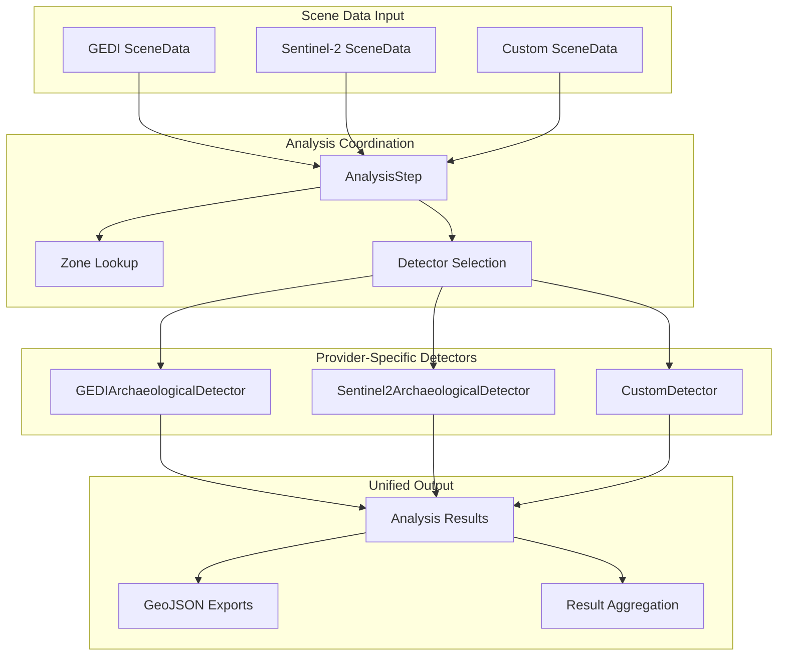

# Analysis Coordination System

## Overview

The Analysis Coordination System (`src/pipeline/analysis.py`) manages the execution and coordination of provider-specific archaeological detectors across different satellite data sources. This component serves as the bridge between the modular pipeline and individual detection algorithms, ensuring consistent analysis workflows and result aggregation.

## Core Architecture

### `AnalysisStep` Class

**Purpose**: Coordinate analysis across multiple providers and scenes with standardized interfaces

```python
class AnalysisStep:
    """Modular analysis step for archaeological pipeline."""
    
    def __init__(self, run_id=None):
        """Initialize analysis coordinator.
        
        Args:
            run_id: Unique identifier for pipeline execution
        """
        self.run_id = run_id
```

### Multi-Provider Coordination Model



## Core Analysis Workflow

### Main Analysis Method

```python
def run(self, scene_data_list: List[SceneData]) -> Dict[str, List[dict]]:
    """Analyze each SceneData object using appropriate detector.
    
    Args:
        scene_data_list: List of SceneData objects from providers
        
    Returns:
        Dict mapping zone_id to list of analysis results
        
    Process:
        1. Group scenes by zone and provider
        2. Apply zone lookup with fallback handling
        3. Select appropriate detector based on provider
        4. Execute analysis with error handling
        5. Export results and aggregate by zone
    """
```

### Implementation Flow

#### Scene Processing Loop
```python
analysis_results: Dict[str, List[dict]] = {}
detector = None

for scene in scene_data_list:
    zone_id = scene.zone_id
    zone = self._get_zone_with_fallback(zone_id)
    
    # Provider-based detector selection
    if scene.provider == "sentinel2":
        detector = Sentinel2ArchaeologicalDetector(zone, run_id=self.run_id)
        required_bands = ["B02", "B03", "B04", "B08"]
    elif scene.provider == "gedi":
        detector = GEDIArchaeologicalDetector(zone, run_id=self.run_id)
        required_bands = []
    else:
        logger.warning(f"Unknown provider: {scene.provider}")
        continue
    
    # Band validation for optical data
    if required_bands:
        missing_bands = [b for b in required_bands if not scene.has_band(b)]
        if missing_bands:
            logger.warning(f"Missing bands {missing_bands} for {scene.scene_id}")
            continue
    
    # Execute provider-specific analysis
    result = self._execute_analysis(detector, scene)
    
    # Aggregate results by zone
    if result and result.get("success"):
        if zone_id not in analysis_results:
            analysis_results[zone_id] = []
        analysis_results[zone_id].append(result)
```

## Zone Management and Fallback

### Dynamic Zone Resolution

The system handles zone identification with robust fallback mechanisms:

#### `_get_zone_with_fallback()` Method

```python
def _get_zone_with_fallback(self, zone_id: str):
    """Get zone configuration with comprehensive fallback handling.
    
    Args:
        zone_id: Zone identifier (may be non-standard)
        
    Returns:
        TargetZone object or dynamically created zone
        
    Fallback Strategy:
        1. Direct lookup in TARGET_ZONES
        2. Normalized zone ID lookup
        3. Dynamic zone creation with default parameters
    """
    
    # Primary lookup
    zone = TARGET_ZONES.get(zone_id, None)
    if zone is not None:
        return zone
    
    # Normalized lookup for variant zone IDs
    normalized_id = self._normalize_zone_id(zone_id)
    zone = TARGET_ZONES.get(normalized_id, None)
    if zone is not None:
        return zone
    
    # Dynamic zone creation
    logger.warning(f"Zone not found for ID: {zone_id}, creating default zone")
    from src.core.config import TargetZone
    return TargetZone(
        id=zone_id,
        name=zone_id.replace("_", " ").title(),
        center=(0.0, 0.0),
        bbox=(-1.0, -73.0, 0.0, -72.0),
        priority=3,
        expected_features="Unknown",
        historical_evidence="Unknown"
    )
```

#### Zone ID Normalization

```python
def _normalize_zone_id(self, zone_id: str) -> str:
    """Normalize zone IDs for consistent lookup.
    
    Handles variations like:
    - "upper-naporegion" → "upper_napo"
    - "uppernaporegion" → "upper_napo"
    - "upper-napo" → "upper_napo"
    """
    zone_mapping = {
        "upper-naporegion": "upper_napo",
        "upper_naporegion": "upper_napo", 
        "uppernaporegion": "upper_napo",
        "upper-napo": "upper_napo"
    }
    
    normalized = zone_id.lower().replace(" ", "_").replace("-", "_")
    return zone_mapping.get(normalized, normalized)
```

## Provider-Specific Analysis Execution

### Sentinel-2 Analysis Path

```python
if isinstance(detector, Sentinel2ArchaeologicalDetector):
    logger.info(f"  Analyzing Sentinel-2 scene: {scene.scene_id}")
    try:
        # Sentinel-2 detector handles SceneData objects directly
        result = detector.detect_features_from_scene(scene)
        
        # Result structure:
        # {
        #     "status": "success",
        #     "message": "Detection completed with adaptive filtering",
        #     "terra_preta_detections": {...},
        #     "geometric_detections": {...},
        #     "crop_mark_detections": {...}
        # }
        
    except Exception as e:
        logger.error(f"Sentinel-2 analysis failed for {scene.scene_id}: {e}")
        result = {"success": False, "error": str(e)}
```

#### Sentinel-2 Feature Extraction

The Sentinel-2 detector performs comprehensive multispectral analysis:

- **Terra Preta Detection**: Enhanced and standard spectral analysis
- **Geometric Pattern Recognition**: Circles, lines, rectangles
- **Crop Mark Analysis**: Vegetation stress indicators
- **Environmental Filtering**: Adaptive density and shape filtering

### GEDI Analysis Path

```python
if isinstance(detector, GEDIArchaeologicalDetector):
    # GEDI uses processed metrics files
    metrics_file = scene.file_paths.get('processed_metrics_file')
    if metrics_file and metrics_file.exists():
        metrics_dir = metrics_file.parent
        logger.info(f"  Analyzing GEDI metrics: {metrics_dir}")
        try:
            result = detector.analyze_scene(metrics_dir)
            
            # Result structure:
            # {
            #     "success": True,
            #     "provider": "gedi",
            #     "total_features": 45,
            #     "clearing_results": {...},
            #     "earthwork_results": {...},
            #     "data_quality": {...}
            # }
            
        except Exception as e:
            logger.error(f"GEDI analysis failed for {scene.scene_id}: {e}")
            result = {"success": False, "error": str(e)}
    else:
        logger.warning(f"GEDI metrics file not found for {scene.scene_id}")
        result = {"success": False, "error": "Missing metrics file"}
```

#### GEDI Feature Extraction

The GEDI detector performs space-based LiDAR analysis:

- **Archaeological Clearings**: Canopy gap clustering and analysis
- **Earthwork Detection**: Elevation anomaly detection and mound identification
- **Linear Features**: Causeway and constructed linear feature detection
- **Quality Assessment**: Data completeness and spatial coverage metrics

## Result Processing and Export

### Feature Count Aggregation

```python
def _calculate_total_features(self, result: Dict[str, Any]) -> int:
    """Calculate total features across all detection types."""
    total_features = result.get('total_features', 0)
    
    # If not directly available, sum from detection summary
    if not total_features and isinstance(result.get('detection_summary'), dict):
        summary = result.get('detection_summary', {})
        
        # Sentinel-2 specific feature counting
        if 'feature_counts' in summary:
            feature_counts = summary.get('feature_counts', {})
            total_features = sum(feature_counts.values()) if isinstance(feature_counts, dict) else 0
        else:
            # Sum individual analysis counts
            feature_types = [
                'terra_preta_analysis_count', 
                'geometric_feature_analysis_count', 
                'crop_mark_analysis_count'
            ]
            total_features = sum(summary.get(field, 0) for field in feature_types)
    
    # Fallback: sum from individual analysis results
    if not total_features:
        analysis_keys = ['terra_preta_analysis', 'geometric_feature_analysis', 'crop_mark_analysis']
        for key in analysis_keys:
            if key in result and isinstance(result[key], dict):
                total_features += result[key].get('count', 0)
    
    return total_features
```

### GeoJSON Export Coordination

```python
def _export_scene_results(self, detector, scene: SceneData, scene_dir: Path) -> None:
    """Export detection results to GeoJSON format."""
    if hasattr(detector, 'export_detections_to_geojson'):
        current_scene_id = scene.scene_id if scene.scene_id else "unknown_scene"
        export_filename = f"{scene.zone_id}_{current_scene_id}_detections.geojson"
        
        # Create provider-specific export directory
        if self.run_id:
            export_dir = RESULTS_DIR / f"run_{self.run_id}" / "exports" / scene.provider
        else:
            export_dir = EXPORTS_DIR / scene.provider
        
        export_path = export_dir / export_filename
        
        try:
            export_dir.mkdir(parents=True, exist_ok=True)
            detector.export_detections_to_geojson(export_path)
            logger.info(f"   Exported detections to {export_path}")
        except Exception as e:
            logger.error(f"Export failed for {current_scene_id}: {e}")
```

## Error Handling and Resilience

### Comprehensive Error Management

```python
def _execute_analysis(self, detector, scene: SceneData) -> Optional[Dict[str, Any]]:
    """Execute analysis with comprehensive error handling."""
    try:
        if isinstance(detector, Sentinel2ArchaeologicalDetector):
            return detector.detect_features_from_scene(scene)
        elif isinstance(detector, GEDIArchaeologicalDetector):
            metrics_file = scene.file_paths.get('processed_metrics_file')
            if metrics_file and metrics_file.exists():
                return detector.analyze_scene(metrics_file.parent)
            else:
                return {"success": False, "error": "Missing GEDI metrics file"}
        else:
            # Generic detector interface
            scene_dir = self._get_scene_directory(scene)
            if scene_dir and scene_dir.exists():
                return detector.analyze_scene(scene_dir)
            else:
                return {"success": False, "error": "Scene directory not found"}
                
    except ImportError as e:
        logger.error(f"Missing dependencies for {scene.scene_id}: {e}")
        return {"success": False, "error": f"Dependency error: {e}"}
    except MemoryError as e:
        logger.error(f"Insufficient memory for {scene.scene_id}: {e}")
        return {"success": False, "error": f"Memory error: {e}"}
    except Exception as e:
        logger.error(f"Unexpected error analyzing {scene.scene_id}: {e}")
        return {"success": False, "error": f"Analysis error: {e}"}
```

### Scene Directory Resolution

```python
def _get_scene_directory(self, scene: SceneData) -> Optional[Path]:
    """Extract scene directory from SceneData with fallback logic."""
    if scene.file_paths:
        # Check for direct directory paths
        for path in scene.file_paths.values():
            if hasattr(path, "is_dir") and path.is_dir():
                return path
            elif hasattr(path, "parent"):
                # Return parent of first file (common scene directory)
                return path.parent 
    
    # Fallback to explicit metadata
    if "scene_directory" in scene.metadata:
        scene_dir_meta = scene.metadata["scene_directory"]
        if scene_dir_meta:
            return Path(scene_dir_meta)
    
    # Last resort: composite file path parent
    if scene.composite_file_path and scene.composite_file_path.exists():
        logger.info(f"Using composite file parent for {scene.scene_id}")
        return scene.composite_file_path.parent
    
    logger.warning(f"Could not determine scene directory for {scene.scene_id}")
    return None
```

## Performance Optimization

### Parallel Scene Processing

```python
import concurrent.futures
from typing import List, Tuple

def run_parallel(self, scene_data_list: List[SceneData], max_workers: int = 4) -> Dict[str, List[dict]]:
    """Execute analysis with parallel processing."""
    analysis_results: Dict[str, List[dict]] = {}
    
    # Group scenes by provider for efficient processing
    provider_scenes = {}
    for scene in scene_data_list:
        provider = scene.provider
        if provider not in provider_scenes:
            provider_scenes[provider] = []
        provider_scenes[provider].append(scene)
    
    # Process each provider group in parallel
    with concurrent.futures.ThreadPoolExecutor(max_workers=max_workers) as executor:
        future_to_provider = {
            executor.submit(self._process_provider_scenes, provider, scenes): provider
            for provider, scenes in provider_scenes.items()
        }
        
        for future in concurrent.futures.as_completed(future_to_provider):
            provider = future_to_provider[future]
            try:
                provider_results = future.result()
                # Merge results
                for zone_id, zone_analyses in provider_results.items():
                    if zone_id not in analysis_results:
                        analysis_results[zone_id] = []
                    analysis_results[zone_id].extend(zone_analyses)
            except Exception as e:
                logger.error(f"Error processing {provider} scenes: {e}")
    
    return analysis_results

def _process_provider_scenes(self, provider: str, scenes: List[SceneData]) -> Dict[str, List[dict]]:
    """Process all scenes for a specific provider."""
    provider_results = {}
    
    for scene in scenes:
        zone_id = scene.zone_id
        zone = self._get_zone_with_fallback(zone_id)
        
        # Create provider-specific detector
        if provider == "sentinel2":
            detector = Sentinel2ArchaeologicalDetector(zone, run_id=self.run_id)
        elif provider == "gedi":
            detector = GEDIArchaeologicalDetector(zone, run_id=self.run_id)
        else:
            continue
        
        # Execute analysis
        result = self._execute_analysis(detector, scene)
        
        if result and result.get("success"):
            if zone_id not in provider_results:
                provider_results[zone_id] = []
            provider_results[zone_id].append(result)
    
    return provider_results
```

### Memory-Efficient Processing

```python
def run_chunked(self, scene_data_list: List[SceneData], chunk_size: int = 10) -> Dict[str, List[dict]]:
    """Process large scene lists in memory-efficient chunks."""
    analysis_results: Dict[str, List[dict]] = {}
    
    # Process scenes in chunks
    for i in range(0, len(scene_data_list), chunk_size):
        chunk = scene_data_list[i:i + chunk_size]
        logger.info(f"Processing chunk {i//chunk_size + 1}: {len(chunk)} scenes")
        
        # Process chunk
        chunk_results = self.run(chunk)
        
        # Merge results
        for zone_id, zone_analyses in chunk_results.items():
            if zone_id not in analysis_results:
                analysis_results[zone_id] = []
            analysis_results[zone_id].extend(zone_analyses)
        
        # Explicit memory cleanup
        del chunk_results
    
    return analysis_results
```

## Integration Patterns

### Custom Detector Integration

```python
# Example: Adding a new detector for custom provider
def _select_detector(self, scene: SceneData, zone):
    """Select appropriate detector based on scene provider."""
    if scene.provider == "sentinel2":
        return Sentinel2ArchaeologicalDetector(zone, run_id=self.run_id)
    elif scene.provider == "gedi":
        return GEDIArchaeologicalDetector(zone, run_id=self.run_id)
    elif scene.provider == "custom_lidar":
        from src.detectors.custom_lidar_detector import CustomLidarDetector
        return CustomLidarDetector(zone, run_id=self.run_id)
    elif scene.provider == "hyperspectral":
        from src.detectors.hyperspectral_detector import HyperspectralDetector
        return HyperspectralDetector(zone, run_id=self.run_id)
    else:
        raise ValueError(f"No detector available for provider: {scene.provider}")
```

### Multi-Provider Scene Handling

```python
def analyze_mixed_providers(self, scene_data_list: List[SceneData]) -> Dict[str, Dict[str, List[dict]]]:
    """Analyze scenes from multiple providers with provider separation."""
    results_by_provider = {}
    
    for scene in scene_data_list:
        provider = scene.provider
        
        if provider not in results_by_provider:
            results_by_provider[provider] = {}
        
        # Execute provider-specific analysis
        zone_id = scene.zone_id
        zone = self._get_zone_with_fallback(zone_id)
        detector = self._select_detector(scene, zone)
        result = self._execute_analysis(detector, scene)
        
        if result and result.get("success"):
            if zone_id not in results_by_provider[provider]:
                results_by_provider[provider][zone_id] = []
            results_by_provider[provider][zone_id].append(result)
    
    return results_by_provider
```

## Usage Examples

### Standard Analysis Workflow

```python
from src.pipeline.analysis import AnalysisStep
from src.providers.gedi_provider import GEDIProvider

# Initialize analysis coordinator
analysis_step = AnalysisStep(run_id="analysis_001")

# Get scene data from provider
provider = GEDIProvider()
scene_data = provider.download_data(["upper_napo_micro"], max_scenes=3)

# Execute coordinated analysis
analysis_results = analysis_step.run(scene_data)

# Results structure: Dict[zone_id, List[analysis_result]]
for zone_id, zone_analyses in analysis_results.items():
    total_features = sum(analysis.get('total_features', 0) for analysis in zone_analyses)
    print(f"Zone {zone_id}: {total_features} features across {len(zone_analyses)} scenes")
```

### Multi-Provider Analysis

```python
# Mixed provider analysis
from src.providers.sentinel2_provider import Sentinel2Provider

gedi_provider = GEDIProvider()
s2_provider = Sentinel2Provider()

# Get data from multiple providers
gedi_scenes = gedi_provider.download_data(["upper_napo_micro"], max_scenes=2)
s2_scenes = s2_provider.download_data(["upper_napo_micro"], max_scenes=2)

# Combine scene data
all_scenes = gedi_scenes + s2_scenes

# Coordinated analysis across providers
analysis_step = AnalysisStep(run_id="multi_provider_001")
results = analysis_step.run(all_scenes)

# Provider-specific result analysis
for zone_id, zone_analyses in results.items():
    gedi_results = [r for r in zone_analyses if r.get('provider') == 'gedi']
    s2_results = [r for r in zone_analyses if r.get('provider') == 'sentinel2']
    
    print(f"Zone {zone_id}:")
    print(f"  GEDI: {len(gedi_results)} analyses")
    print(f"  Sentinel-2: {len(s2_results)} analyses")
```

The Multi-Sensor Analysis Coordination system provides a flexible, robust framework for integrating archaeological detectors across diverse satellite data sources while maintaining provider independence and enabling sophisticated multi-sensor archaeological analysis workflows.