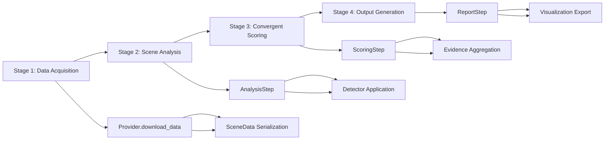

# Modular Pipeline System

## Overview

The Modular Pipeline (`src/pipeline/modular_pipeline.py`) is the core orchestration system for the Amazon Archaeological Discovery Pipeline. It implements a four-stage archaeological analysis workflow with provider isolation, intermediate persistence, and comprehensive error handling. This system enables flexible execution patterns while maintaining data integrity and result reproducibility.

## Architecture

### Four-Stage Pipeline Design



### Core Components

#### `ModularPipeline` Class

**Primary Class**: Central orchestrator with provider-specific initialization

```python
class ModularPipeline:
    def __init__(self, provider_instance: BaseProvider, run_id: str):
        """Initialize pipeline with provider and unique run identifier.
        
        Args:
            provider_instance: Data provider (GEDI, Sentinel-2, etc.)
            run_id: Unique identifier for this pipeline run
        """
        self.provider_instance = provider_instance
        self.run_id = run_id
        self.provider_name = provider_instance.__class__.__name__.lower().replace('provider', '')
        
        # Initialize pipeline components
        self.analysis_step = AnalysisStep(run_id=run_id)
        self.scoring_step = ScoringStep()
        self.report_step = ReportStep(run_id=run_id)
```

#### Directory Structure Management

**Run-Specific Isolation**: Each pipeline execution creates isolated result directories:

```
results/
└── run_{run_id}/
    ├── scene_data.json              # Stage 1 output
    ├── analysis_results.json        # Stage 2 output
    ├── scoring_results.json         # Stage 3 output
    ├── exports/
    │   └── unified/                 # Stage 4 GeoJSON exports
    └── reports/                     # Stage 4 reports and maps
```

## Stage 1: Data Acquisition

### Purpose
Download and standardize satellite data from configured providers with automatic caching and validation.

### Method Signature
```python
def acquire_data(self, zones: List[str], max_scenes: int = 3) -> List[SceneData]:
    """Download and prepare data for analysis.
    
    Args:
        zones: List of zone IDs to process (e.g., ["upper_napo_micro"])
        max_scenes: Maximum scenes per zone
        
    Returns:
        List of SceneData objects ready for analysis
        
    Side Effects:
        - Downloads raw data via provider
        - Saves SceneData objects to JSON for persistence
        - Creates run-specific directory structure
    """
```

### Implementation Details

#### Data Download Process
```python
# Delegate to provider
logger.info(f"🛰️ Acquiring data via {self.provider_name}")
scene_data_list = self.provider_instance.download_data(zones, max_scenes)

# Log acquisition summary
total_scenes = len(scene_data_list)
zones_processed = set(scene.zone_id for scene in scene_data_list)
logger.info(f"📊 Acquired {total_scenes} scenes across {len(zones_processed)} zones")
```

#### Persistence and Serialization
```python
# Save SceneData objects to JSON
scene_data_path = self.results_dir / "scene_data.json"
serialized_data = []

for scene in scene_data_list:
    scene_dict = {
        "zone_id": scene.zone_id,
        "provider": scene.provider,
        "scene_id": scene.scene_id,
        "file_paths": {k: str(v) for k, v in scene.file_paths.items()},
        "available_bands": scene.available_bands,
        "metadata": scene.metadata or {}
    }
    serialized_data.append(scene_dict)

with open(scene_data_path, 'w') as f:
    json.dump(serialized_data, f, indent=2, default=str)
```

### Error Handling
- **Provider Failures**: Graceful handling of data download errors
- **Network Issues**: Retry mechanisms and timeout management
- **Storage Validation**: Ensure sufficient disk space before download
- **Partial Results**: Continue processing with available data

## Stage 2: Scene Analysis

### Purpose
Apply provider-specific archaeological detectors to downloaded scenes with feature extraction and export.

### Method Signature
```python
def analyze_scenes(self, scene_data_input: Union[List[SceneData], Path]) -> Dict[str, List[dict]]:
    """Apply archaeological detectors to scenes.
    
    Args:
        scene_data_input: Either SceneData list or path to saved scene data
        
    Returns:
        Dict mapping zone_id to list of analysis results
        
    Side Effects:
        - Applies provider-specific detectors
        - Exports individual detection GeoJSON files
        - Saves analysis results to JSON
    """
```

### Input Flexibility
```python
# Accept both in-memory data and file paths
if isinstance(scene_data_input, Path):
    # Load from saved JSON
    scene_data_list = self._load_scene_data_from_json(scene_data_input)
elif isinstance(scene_data_input, list):
    # Use provided SceneData objects
    scene_data_list = scene_data_input
else:
    raise ValueError("Invalid scene_data_input type")
```

### Analysis Coordination
```python
# Delegate to AnalysisStep for multi-provider coordination
logger.info(f"🔍 Analyzing {len(scene_data_list)} scenes")
analysis_results = self.analysis_step.run(scene_data_list)

# Log analysis summary
total_features = 0
for zone_id, zone_analyses in analysis_results.items():
    zone_features = sum(analysis.get('total_features', 0) for analysis in zone_analyses)
    total_features += zone_features
    logger.info(f"📍 Zone {zone_id}: {zone_features} features detected")

logger.info(f"✅ Analysis complete: {total_features} total features")
```

### Result Persistence
```python
# Save analysis results with metadata
analysis_results_path = self.results_dir / "analysis_results.json"
analysis_metadata = {
    "timestamp": datetime.now().isoformat(),
    "provider": self.provider_name,
    "total_scenes_analyzed": len(scene_data_list),
    "total_features_detected": total_features,
    "analysis_results": analysis_results
}

with open(analysis_results_path, 'w') as f:
    json.dump(analysis_metadata, f, indent=2, default=str)
```

## Stage 3: Convergent Scoring

### Purpose
Aggregate detection evidence across providers using **real coordinates** from detector outputs and calculate multi-evidence archaeological anomaly scores.

### ⚠️ Critical Update: Real Coordinate Extraction System
**As of June 2025**, the scoring system has been completely rewritten to use **real detector coordinates** instead of synthetic zone-center coordinates. This ensures:

- **Spatial Integrity**: All features use actual satellite detection coordinates
- **Scientific Accuracy**: Scoring reflects true geographical distribution
- **Field Investigation Validity**: Export coordinates represent genuine archaeological sites

#### Coordinate Data Sources
```python
# Real coordinate extraction from detector outputs
terra_preta_analysis = analysis_output.get("terra_preta_analysis", {})
if terra_preta_analysis and terra_preta_analysis.get("geojson_path"):
    # Load real coordinates from Sentinel-2 detector GeoJSON
    with open(terra_preta_analysis["geojson_path"], 'r') as f:
        tp_geojson = json.load(f)
    
    for feature in tp_geojson.get("features", []):
        real_coords = feature.get("properties", {}).get("coordinates")
        # Use real detector coordinates, not synthetic ones
```

### Method Signature
```python
def score_zones(self, analysis_results_input: Union[Dict[str, List[dict]], Path]) -> Dict[str, Dict[str, Any]]:
    """Calculate convergent anomaly scores for zones.
    
    Args:
        analysis_results_input: Analysis results or path to saved results
        
    Returns:
        Dict mapping zone_id to scoring results
        
    Side Effects:
        - Aggregates features across providers
        - Calculates multi-evidence convergence scores
        - Saves scoring results to JSON
    """
```

### Scoring Process
```python
# Load analysis results if path provided
if isinstance(analysis_results_input, Path):
    with open(analysis_results_input, 'r') as f:
        analysis_data = json.load(f)
        analysis_results = analysis_data.get("analysis_results", {})
else:
    analysis_results = analysis_results_input

# Apply convergent scoring
logger.info(f"🎯 Calculating convergent scores for {len(analysis_results)} zones")
scoring_results = self.scoring_step.run(analysis_results)

# Log scoring summary
high_confidence_zones = [zone for zone, result in scoring_results.items() 
                        if result.get('total_score', 0) >= 10]
probable_zones = [zone for zone, result in scoring_results.items() 
                 if 7 <= result.get('total_score', 0) < 10]

logger.info(f"🏆 High confidence zones: {len(high_confidence_zones)}")
logger.info(f"🎖️ Probable zones: {len(probable_zones)}")
```

### Score Classification
```python
# Classification mapping
classifications = {
    zone_id: {
        "score": result.get('total_score', 0),
        "classification": result.get('classification', 'NATURAL'),
        "confidence": result.get('confidence', 0.0),
        "evidence_count": len(result.get('evidence_summary', []))
    }
    for zone_id, result in scoring_results.items()
}
```

## Stage 4: Output Generation

### Purpose
Generate comprehensive reports, interactive visualizations, and quality-controlled exports for field investigation.

### Method Signature
```python
def generate_outputs(self, analysis_results: Dict[str, List[dict]], 
                    scoring_results: Dict[str, Dict[str, Any]]) -> Dict[str, Any]:
    """Generate reports and visualizations.
    
    Args:
        analysis_results: Scene analysis results
        scoring_results: Zone scoring results
        
    Returns:
        Dict containing paths to generated files
        
    Side Effects:
        - Generates comprehensive JSON report
        - Creates markdown summary
        - Produces interactive visualizations
        - Exports quality-filtered GeoJSON files
    """
```

### Report Generation
```python
# Generate comprehensive report
logger.info("📊 Generating comprehensive analysis report")
report = self.report_step.run(scoring_results, analysis_results, provider=self.provider_name)

# Report includes:
# - Executive summary with key findings
# - Zone-by-zone detailed analysis
# - High-priority sites for field investigation
# - Provider performance analysis
# - Actionable recommendations
```

### Visualization Creation
```python
# Generate interactive visualizations
logger.info("🗺️ Creating interactive visualizations")
visualization_paths = {}

try:
    from src.core.visualizers import create_interactive_map
    
    # Create provider-specific map
    provider_map_path = self.results_dir / "maps" / f"{self.provider_name}_features_map.html"
    create_interactive_map(analysis_results, provider_map_path, provider=self.provider_name)
    visualization_paths["provider_map"] = provider_map_path
    
    # Create convergent analysis map
    convergent_map_path = self.results_dir / "maps" / "convergent_analysis_map.html"
    create_convergent_map(scoring_results, convergent_map_path)
    visualization_paths["convergent_map"] = convergent_map_path
    
except ImportError:
    logger.warning("Visualization dependencies not available")
```

### Export Management
```python
# Generate quality-controlled exports
from src.pipeline.export_manager import UnifiedExportManager

export_manager = UnifiedExportManager(self.run_id, self.results_dir)
export_paths = {}

# Export by provider
for zone_id, zone_analyses in analysis_results.items():
    for analysis in zone_analyses:
        if analysis.get('success') and analysis.get('total_features', 0) > 0:
            export_path = export_manager.export_provider_features(
                analysis, zone_id, provider=self.provider_name
            )
            export_paths[f"{zone_id}_{self.provider_name}"] = export_path

# Export top candidates for field work
top_candidates = self._extract_top_candidates(scoring_results, limit=10)
if top_candidates:
    candidates_path = export_manager.export_top_candidates(top_candidates, "priority_sites")
    export_paths["top_candidates"] = candidates_path
```

## Complete Pipeline Execution

### Full Pipeline Method
```python
def run(self, zones: Optional[List[str]] = None, max_scenes: int = 3) -> Dict[str, object]:
    """Execute complete four-stage pipeline.
    
    Args:
        zones: Zone IDs to process (None = default zones)
        max_scenes: Maximum scenes per zone
        
    Returns:
        Dict containing all pipeline results and output paths
    """
```

### Execution Flow
```python
# Pipeline execution with comprehensive logging
execution_start = datetime.now()
logger.info(f"🚀 Starting {self.provider_name} pipeline run: {self.run_id}")

try:
    # Stage 1: Data Acquisition
    logger.info("=" * 50)
    logger.info("STAGE 1: DATA ACQUISITION")
    logger.info("=" * 50)
    scene_data = self.acquire_data(zones or self._get_default_zones(), max_scenes)
    
    if not scene_data:
        logger.warning("No data acquired - pipeline terminated")
        return {"status": "no_data", "scene_data": []}
    
    # Stage 2: Scene Analysis
    logger.info("=" * 50)
    logger.info("STAGE 2: SCENE ANALYSIS")
    logger.info("=" * 50)
    analysis_results = self.analyze_scenes(scene_data)
    
    # Stage 3: Convergent Scoring
    logger.info("=" * 50)
    logger.info("STAGE 3: CONVERGENT SCORING")
    logger.info("=" * 50)
    scoring_results = self.score_zones(analysis_results)
    
    # Stage 4: Output Generation
    logger.info("=" * 50)
    logger.info("STAGE 4: OUTPUT GENERATION")
    logger.info("=" * 50)
    outputs = self.generate_outputs(analysis_results, scoring_results)
    
    # Execution summary
    execution_time = datetime.now() - execution_start
    logger.info("=" * 50)
    logger.info(f"✅ PIPELINE COMPLETE: {execution_time}")
    logger.info("=" * 50)
    
    return {
        "status": "success",
        "execution_time": str(execution_time),
        "scene_data": scene_data,
        "analysis_results": analysis_results,
        "scoring_results": scoring_results,
        "outputs": outputs,
        "run_id": self.run_id
    }
    
except Exception as e:
    logger.error(f"❌ Pipeline execution failed: {e}")
    return {
        "status": "failed",
        "error": str(e),
        "run_id": self.run_id
    }
```

## Advanced Features

### Stage Independence

Each stage can be executed independently with file persistence:

```python
# Sequential execution with file persistence
scene_data = pipeline.acquire_data(["upper_napo_micro"])
analysis_results = pipeline.analyze_scenes(scene_data)
scoring_results = pipeline.score_zones(analysis_results)
outputs = pipeline.generate_outputs(analysis_results, scoring_results)

# Resume from saved results
analysis_results = pipeline.analyze_scenes(Path("results/run_001/scene_data.json"))
scoring_results = pipeline.score_zones(Path("results/run_001/analysis_results.json"))
```

### Error Recovery

```python
def run_with_recovery(self, zones: List[str], max_scenes: int = 3) -> Dict[str, object]:
    """Execute pipeline with automatic error recovery."""
    
    # Attempt to resume from last successful stage
    if self._has_cached_scene_data():
        logger.info("Resuming from cached scene data")
        scene_data_path = self.results_dir / "scene_data.json"
        analysis_results = self.analyze_scenes(scene_data_path)
    else:
        # Full execution from data acquisition
        scene_data = self.acquire_data(zones, max_scenes)
        analysis_results = self.analyze_scenes(scene_data)
    
    # Continue with remaining stages
    scoring_results = self.score_zones(analysis_results)
    outputs = self.generate_outputs(analysis_results, scoring_results)
    
    return {
        "status": "success",
        "scene_data": scene_data if 'scene_data' in locals() else "cached",
        "analysis_results": analysis_results,
        "scoring_results": scoring_results,
        "outputs": outputs
    }
```

### Performance Optimization

```python
# Memory-efficient processing for large datasets
def run_large_scale(self, zones: List[str], batch_size: int = 5) -> Dict[str, object]:
    """Execute pipeline with memory optimization for large-scale processing."""
    
    # Process zones in batches
    all_results = {"analysis_results": {}, "scoring_results": {}}
    
    for i in range(0, len(zones), batch_size):
        batch_zones = zones[i:i + batch_size]
        logger.info(f"Processing batch {i//batch_size + 1}: {batch_zones}")
        
        # Execute pipeline for batch
        batch_results = self.run(batch_zones, max_scenes=3)
        
        # Accumulate results
        all_results["analysis_results"].update(batch_results["analysis_results"])
        all_results["scoring_results"].update(batch_results["scoring_results"])
        
        # Memory cleanup
        del batch_results
    
    # Generate final outputs
    outputs = self.generate_outputs(
        all_results["analysis_results"], 
        all_results["scoring_results"]
    )
    
    return {
        "status": "success",
        "total_zones": len(zones),
        "batch_size": batch_size,
        **all_results,
        "outputs": outputs
    }
```

## Usage Examples

### Basic Pipeline Execution
```python
from src.providers.gedi_provider import GEDIProvider
from src.pipeline.modular_pipeline import ModularPipeline

# Initialize pipeline
provider = GEDIProvider()
pipeline = ModularPipeline(provider, run_id="archaeological_survey_001")

# Execute complete pipeline
results = pipeline.run(zones=["upper_napo_micro"], max_scenes=5)

# Access results
print(f"Analysis complete: {results['status']}")
print(f"Features detected: {sum(len(zone_analyses) for zone_analyses in results['analysis_results'].values())}")
```

### Stage-by-Stage Execution
```python
# Fine-grained control over pipeline execution
pipeline = ModularPipeline(provider, run_id="detailed_analysis_001")

# Stage 1: Acquire data
scene_data = pipeline.acquire_data(["upper_napo_micro", "upper_napo_micro_small"])
print(f"Downloaded {len(scene_data)} scenes")

# Stage 2: Analyze with custom parameters
analysis_results = pipeline.analyze_scenes(scene_data)
print(f"Analyzed {len(analysis_results)} zones")

# Stage 3: Score with detailed logging
scoring_results = pipeline.score_zones(analysis_results)
for zone_id, score_data in scoring_results.items():
    print(f"{zone_id}: {score_data['total_score']} points ({score_data['classification']})")

# Stage 4: Generate outputs
outputs = pipeline.generate_outputs(analysis_results, scoring_results)
print(f"Generated reports: {list(outputs.keys())}")
```

The Modular Pipeline System provides a robust, flexible foundation for archaeological analysis workflows, enabling both rapid prototyping and large-scale production processing while maintaining scientific rigor and result reproducibility.