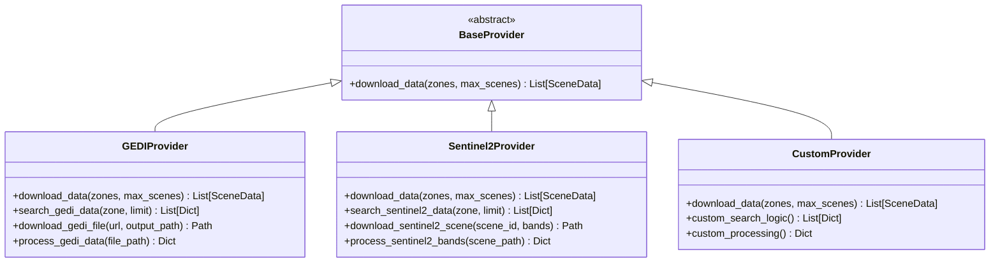

# Provider Development Guide

**Amazon Archaeological Discovery Pipeline - Custom Data Provider Framework**

---

## Table of Contents

1. [Provider Architecture Overview](#provider-architecture-overview)
2. [BaseProvider Interface](#baseprovider-interface)
3. [Provider Implementation Guide](#provider-implementation-guide)
4. [Data Standardization](#data-standardization)
5. [Provider Registration](#provider-registration)
6. [Testing Custom Providers](#testing-custom-providers)
7. [Advanced Provider Features](#advanced-provider-features)
8. [Real-World Examples](#real-world-examples)
9. [Best Practices](#best-practices)
10. [Troubleshooting](#troubleshooting)

---

## Provider Architecture Overview

The Amazon Archaeological Discovery Pipeline uses a modular provider architecture that enables seamless integration of diverse satellite and remote sensing data sources. This architecture supports both existing providers (GEDI, Sentinel-2) and custom implementations for specialized data sources.

## Provider Architecture

### Core Design Principles

1. **Standardized Interface**: All providers implement the `BaseProvider` abstract interface
2. **Data Normalization**: Providers return standardized `SceneData` objects
3. **Error Handling**: Robust error handling with graceful degradation
4. **Caching Support**: Built-in caching for downloaded data
5. **Scalable Design**: Support for processing multiple zones and scenes

### Provider Hierarchy



---

## Base Provider Interface

### `BaseProvider` Abstract Class

All data providers must inherit from and implement the `BaseProvider` interface:

```python
from abc import ABC, abstractmethod
from typing import List
from src.core.data_objects import SceneData

class BaseProvider(ABC):
    """Abstract base class for all satellite data providers."""
    
    @abstractmethod
    def download_data(self, zones: List[str], max_scenes: int = 3) -> List[SceneData]:
        """Download data for specified zones.
        
        Args:
            zones: List of zone IDs to process (e.g., ["upper_napo_micro"])
            max_scenes: Maximum number of scenes to download per zone
            
        Returns:
            List of SceneData objects containing downloaded data
            
        Raises:
            ProviderError: When data download fails
            AuthenticationError: When API credentials are invalid
            DataNotFoundError: When no data is available for specified zones
        """
        pass
```

### Required Implementation Components

#### 1. Data Download Logic
- Search for available data within zone boundaries
- Handle authentication and API access
- Download data files to local cache
- Process raw data into standardized format

#### 2. Error Handling
- Network connectivity issues
- Authentication failures
- Data format problems
- Storage space limitations

#### 3. Caching Management
- Organize downloaded data by zone and date
- Implement cache validation and cleanup
- Support for incremental downloads

#### 4. Data Quality Validation
- Verify data completeness
- Check for corrupted files
- Validate geographic bounds
- Ensure temporal consistency

---

## SceneData Standardization

### `SceneData` Object Structure

All providers must return `SceneData` objects with consistent structure:

```python
from pathlib import Path
from typing import Dict, List, Optional

class SceneData:
    def __init__(self,
                 zone_id: str,                    # Target zone identifier
                 provider: str,                   # Provider name ("gedi", "sentinel2", etc.)
                 scene_id: str,                   # Unique scene identifier
                 file_paths: Dict[str, Path],     # File paths by band/data type
                 available_bands: List[str],      # List of available bands
                 metadata: Optional[Dict] = None, # Scene metadata
                 features: Optional[List] = None, # Pre-extracted features
                 composite_file_path: Optional[Path] = None,  # Processed data file
                 provider_name: Optional[str] = None):        # Alternative provider name
```

### SceneData Best Practices

#### File Path Organization
```python
# Organize files by provider and scene
file_paths = {
    "processed_metrics_file": cache_dir / "gedi_metrics.json",
    "raw_data_file": cache_dir / "raw_data.h5",
    "B04": cache_dir / "B04_red.tif",  # For optical data
    "B08": cache_dir / "B08_nir.tif"
}

# Create SceneData with proper organization
scene_data = SceneData(
    zone_id=zone_id,
    provider="custom_provider",
    scene_id=unique_scene_id,
    file_paths=file_paths,
    available_bands=["B04", "B08"],
    metadata={
        "acquisition_date": datetime.now(),
        "cloud_cover": 0.15,
        "data_quality": "high"
    }
)
```

#### Metadata Standards
```python
# Required metadata fields
required_metadata = {
    "acquisition_date": "2024-06-15T10:30:00Z",  # ISO format
    "data_quality": "high|medium|low",            # Quality assessment
    "spatial_resolution": 10.0,                   # Meters per pixel
    "temporal_resolution": "daily|weekly|monthly" # Temporal frequency
}

# Optional but recommended metadata
optional_metadata = {
    "cloud_cover": 0.15,              # Fraction (0.0-1.0)
    "sun_elevation": 45.2,            # Degrees
    "sensor_type": "MSI|GEDI|Custom", # Sensor identifier
    "processing_level": "L1C|L2A|L2B", # Processing level
    "coordinate_system": "EPSG:4326",  # CRS
    "bounds": [-73.0, -1.0, -72.0, 0.0]  # [min_lon, min_lat, max_lon, max_lat]
}
```

---

## GEDI Provider Implementation Example

### Complete GEDI Provider Structure

```python
import requests
import h5py
import json
import numpy as np
from pathlib import Path
from typing import List, Dict, Any
from datetime import datetime, timedelta

from src.core.data_objects import BaseProvider, SceneData
from src.core.config import get_api_config, TARGET_ZONES, CACHE_DIR

class GEDIProvider(BaseProvider):
    """NASA GEDI space-based LiDAR data provider."""
    
    def __init__(self):
        """Initialize GEDI provider with NASA Earthdata credentials."""
        self.api_config = get_api_config()
        self.session = requests.Session()
        self.base_url = "https://cmr.earthdata.nasa.gov/search"
        self.cache_dir = CACHE_DIR / "gedi"
        self.cache_dir.mkdir(parents=True, exist_ok=True)
        
        # Authenticate with NASA Earthdata
        self._authenticate()
    
    def _authenticate(self) -> None:
        """Authenticate with NASA Earthdata system."""
        if not self.api_config.earthdata_username or not self.api_config.earthdata_password:
            raise AuthenticationError("NASA Earthdata credentials required")
        
        self.session.auth = (
            self.api_config.earthdata_username,
            self.api_config.earthdata_password
        )
    
    def download_data(self, zones: List[str], max_scenes: int = 3) -> List[SceneData]:
        """Download GEDI data for specified zones."""
        scene_data_list = []
        
        for zone_id in zones:
            try:
                zone = TARGET_ZONES.get(zone_id)
                if not zone:
                    logger.warning(f"Zone {zone_id} not found in configuration")
                    continue
                
                # Search for available GEDI data
                granules = self._search_gedi_granules(zone, max_scenes)
                
                for granule in granules[:max_scenes]:
                    scene_data = self._download_and_process_granule(granule, zone_id)
                    if scene_data:
                        scene_data_list.append(scene_data)
                        
            except Exception as e:
                logger.error(f"Error downloading GEDI data for zone {zone_id}: {e}")
                continue
        
        return scene_data_list
    
    def _search_gedi_granules(self, zone: TargetZone, limit: int) -> List[Dict]:
        """Search for GEDI granules within zone boundaries."""
        # Temporal constraints (prefer recent data)
        end_date = datetime.now()
        start_date = end_date - timedelta(days=365)  # Last year
        
        # CMR search parameters
        search_params = {
            "collection_concept_id": "C1908348134-LPDAAC_ECS",  # GEDI L2A
            "bounding_box": f"{zone.bbox[1]},{zone.bbox[0]},{zone.bbox[3]},{zone.bbox[2]}",
            "temporal": f"{start_date.isoformat()},{end_date.isoformat()}",
            "page_size": limit,
            "page_num": 1
        }
        
        try:
            response = self.session.get(
                f"{self.base_url}/granules.json",
                params=search_params,
                timeout=30
            )
            response.raise_for_status()
            
            data = response.json()
            granules = data.get("feed", {}).get("entry", [])
            
            logger.info(f"Found {len(granules)} GEDI granules for zone {zone.id}")
            return granules
            
        except Exception as e:
            logger.error(f"GEDI granule search failed: {e}")
            return []
    
    def _download_and_process_granule(self, granule: Dict, zone_id: str) -> Optional[SceneData]:
        """Download and process a single GEDI granule."""
        try:
            # Extract granule information
            granule_id = granule["title"]
            download_links = [link["href"] for link in granule.get("links", []) 
                            if link.get("rel") == "http://esipfed.org/ns/fedsearch/1.1/data#"]
            
            if not download_links:
                logger.warning(f"No download links found for granule {granule_id}")
                return None
            
            download_url = download_links[0]
            
            # Create scene-specific cache directory
            scene_cache_dir = self.cache_dir / zone_id / granule_id
            scene_cache_dir.mkdir(parents=True, exist_ok=True)
            
            # Download HDF5 file
            h5_file_path = scene_cache_dir / f"{granule_id}.h5"
            if not h5_file_path.exists():
                self._download_file(download_url, h5_file_path)
            
            # Process GEDI data
            processed_data = self._process_gedi_h5(h5_file_path)
            
            # Save processed metrics
            metrics_file = scene_cache_dir / "gedi_metrics.json"
            with open(metrics_file, 'w') as f:
                json.dump(processed_data, f, indent=2, default=str)
            
            # Create SceneData object
            scene_data = SceneData(
                zone_id=zone_id,
                provider="gedi",
                scene_id=granule_id,
                file_paths={
                    "processed_metrics_file": metrics_file,
                    "raw_h5_file": h5_file_path
                },
                available_bands=["rh95", "rh100", "canopy_height", "ground_elevation"],
                metadata={
                    "acquisition_date": granule.get("time_start", ""),
                    "data_quality": self._assess_data_quality(processed_data),
                    "spatial_resolution": 25.0,  # 25m footprints
                    "sensor_type": "GEDI",
                    "processing_level": "L2A",
                    "total_footprints": len(processed_data.get("longitude", []))
                }
            )
            
            logger.info(f"Processed GEDI granule {granule_id} with {scene_data.metadata['total_footprints']} footprints")
            return scene_data
            
        except Exception as e:
            logger.error(f"Error processing GEDI granule {granule.get('title', 'unknown')}: {e}")
            return None
    
    def _download_file(self, url: str, output_path: Path) -> None:
        """Download file with progress tracking."""
        response = self.session.get(url, stream=True, timeout=300)
        response.raise_for_status()
        
        total_size = int(response.headers.get('content-length', 0))
        downloaded_size = 0
        
        with open(output_path, 'wb') as f:
            for chunk in response.iter_content(chunk_size=8192):
                if chunk:
                    f.write(chunk)
                    downloaded_size += len(chunk)
                    
                    # Progress logging every 10MB
                    if downloaded_size % (10 * 1024 * 1024) == 0:
                        progress = (downloaded_size / total_size) * 100 if total_size > 0 else 0
                        logger.info(f"Download progress: {progress:.1f}%")
    
    def _process_gedi_h5(self, h5_file_path: Path) -> Dict[str, Any]:
        """Process GEDI HDF5 file into standardized format."""
        processed_data = {
            "longitude": [],
            "latitude": [],
            "canopy_height": [],
            "rh95": [],
            "rh100": [],
            "elevation_ground": [],
            "quality_flags": []
        }
        
        try:
            with h5py.File(h5_file_path, 'r') as h5_file:
                # GEDI has multiple beams
                beam_groups = [key for key in h5_file.keys() if key.startswith('BEAM')]
                
                for beam_name in beam_groups:
                    beam_group = h5_file[beam_name]
                    
                    # Extract geolocation data
                    if 'geolocation' in beam_group:
                        geoloc = beam_group['geolocation']
                        
                        lons = geoloc['longitude_bin0'][:]
                        lats = geoloc['latitude_bin0'][:]
                        
                        # Extract elevation data
                        if 'elevation' in beam_group:
                            elev = beam_group['elevation']
                            
                            rh95 = elev.get('rh_95', [])
                            rh100 = elev.get('rh_100', [])
                            ground_elev = elev.get('elev_lowestmode', [])
                            
                            # Calculate canopy height
                            canopy_height = np.array(rh95) if len(rh95) > 0 else np.array(rh100)
                            
                            # Quality filtering
                            quality_flags = elev.get('quality_flag', [])
                            
                            # Only include high-quality data
                            valid_indices = np.where(np.array(quality_flags) == 1)[0] if len(quality_flags) > 0 else range(len(lons))
                            
                            # Append to processed data
                            processed_data["longitude"].extend(lons[valid_indices])
                            processed_data["latitude"].extend(lats[valid_indices])
                            processed_data["canopy_height"].extend(canopy_height[valid_indices])
                            processed_data["rh95"].extend(rh95[valid_indices] if len(rh95) > 0 else [])
                            processed_data["rh100"].extend(rh100[valid_indices] if len(rh100) > 0 else [])
                            processed_data["elevation_ground"].extend(ground_elev[valid_indices] if len(ground_elev) > 0 else [])
                            processed_data["quality_flags"].extend(quality_flags[valid_indices] if len(quality_flags) > 0 else [])
        
        except Exception as e:
            logger.error(f"Error processing GEDI HDF5 file: {e}")
            raise
        
        # Convert to lists for JSON serialization
        for key in processed_data:
            processed_data[key] = [float(x) for x in processed_data[key]]
        
        return processed_data
    
    def _assess_data_quality(self, processed_data: Dict[str, Any]) -> str:
        """Assess data quality based on metrics."""
        total_points = len(processed_data.get("longitude", []))
        
        if total_points == 0:
            return "low"
        elif total_points < 100:
            return "medium"
        else:
            return "high"
```

---

## Sentinel-2 Provider Implementation Example

### Key Implementation Patterns

```python
class Sentinel2Provider(BaseProvider):
    """ESA Sentinel-2 multispectral imagery provider."""
    
    def __init__(self):
        """Initialize Sentinel-2 provider."""
        self.api_config = get_api_config()
        self.cache_dir = CACHE_DIR / "sentinel2"
        self.cache_dir.mkdir(parents=True, exist_ok=True)
        
        # Initialize Google Earth Engine or other Sentinel-2 access
        self._initialize_data_access()
    
    def download_data(self, zones: List[str], max_scenes: int = 3) -> List[SceneData]:
        """Download Sentinel-2 data for specified zones."""
        scene_data_list = []
        
        for zone_id in zones:
            try:
                zone = TARGET_ZONES.get(zone_id)
                if not zone:
                    continue
                
                # Search for cloud-free Sentinel-2 scenes
                scenes = self._search_sentinel2_scenes(zone, max_scenes)
                
                for scene in scenes[:max_scenes]:
                    scene_data = self._download_and_process_scene(scene, zone_id)
                    if scene_data:
                        scene_data_list.append(scene_data)
                        
            except Exception as e:
                logger.error(f"Error downloading Sentinel-2 data for zone {zone_id}: {e}")
                continue
        
        return scene_data_list
    
    def _search_sentinel2_scenes(self, zone: TargetZone, limit: int) -> List[Dict]:
        """Search for suitable Sentinel-2 scenes."""
        # Implementation depends on data access method:
        # - Google Earth Engine API
        # - Copernicus Open Access Hub
        # - AWS Open Data
        # - Microsoft Planetary Computer
        pass
    
    def _download_and_process_scene(self, scene: Dict, zone_id: str) -> Optional[SceneData]:
        """Download and process Sentinel-2 scene."""
        # Required bands for archaeological analysis
        required_bands = ["B02", "B03", "B04", "B05", "B06", "B07", "B08", "B11", "B12"]
        
        # Download bands
        band_paths = {}
        for band in required_bands:
            band_path = self._download_band(scene, band, zone_id)
            if band_path:
                band_paths[band] = band_path
        
        # Create SceneData object
        scene_data = SceneData(
            zone_id=zone_id,
            provider="sentinel2",
            scene_id=scene["scene_id"],
            file_paths=band_paths,
            available_bands=list(band_paths.keys()),
            metadata={
                "acquisition_date": scene["acquisition_date"],
                "cloud_cover": scene["cloud_cover"],
                "data_quality": "high" if scene["cloud_cover"] < 0.2 else "medium",
                "spatial_resolution": 10.0,
                "sensor_type": "MSI",
                "processing_level": "L2A"
            }
        )
        
        return scene_data
```

---

## Custom Provider Development

### Step-by-Step Custom Provider Creation

#### 1. Define Provider Class

```python
from src.core.data_objects import BaseProvider, SceneData
from src.core.config import TARGET_ZONES, CACHE_DIR
import requests
import numpy as np
from pathlib import Path
from typing import List, Dict, Optional

class CustomSatelliteProvider(BaseProvider):
    """Custom satellite data provider example."""
    
    def __init__(self):
        """Initialize custom provider."""
        self.provider_name = "custom_satellite"
        self.cache_dir = CACHE_DIR / self.provider_name
        self.cache_dir.mkdir(parents=True, exist_ok=True)
        
        # Initialize API connections, authentication, etc.
        self._setup_api_access()
    
    def _setup_api_access(self):
        """Setup API access and authentication."""
        # Configure API endpoints, credentials, etc.
        self.api_base_url = "https://api.customsatellite.com/v1"
        self.session = requests.Session()
        # Add authentication headers, etc.
    
    def download_data(self, zones: List[str], max_scenes: int = 3) -> List[SceneData]:
        """Download data for specified zones."""
        scene_data_list = []
        
        for zone_id in zones:
            zone = TARGET_ZONES.get(zone_id)
            if not zone:
                continue
            
            # Search for data within zone
            available_scenes = self._search_data(zone, max_scenes)
            
            # Download and process scenes
            for scene_info in available_scenes:
                scene_data = self._process_scene(scene_info, zone_id)
                if scene_data:
                    scene_data_list.append(scene_data)
        
        return scene_data_list
    
    def _search_data(self, zone: TargetZone, limit: int) -> List[Dict]:
        """Search for available data within zone boundaries."""
        search_params = {
            "bbox": zone.bbox,
            "limit": limit,
            "cloud_cover_max": 0.3,
            "start_date": "2023-01-01",
            "end_date": "2024-12-31"
        }
        
        try:
            response = self.session.get(
                f"{self.api_base_url}/search",
                params=search_params,
                timeout=30
            )
            response.raise_for_status()
            return response.json().get("scenes", [])
        except Exception as e:
            logger.error(f"Search failed: {e}")
            return []
    
    def _process_scene(self, scene_info: Dict, zone_id: str) -> Optional[SceneData]:
        """Process individual scene."""
        try:
            scene_id = scene_info["scene_id"]
            
            # Create scene cache directory
            scene_cache_dir = self.cache_dir / zone_id / scene_id
            scene_cache_dir.mkdir(parents=True, exist_ok=True)
            
            # Download data files
            file_paths = {}
            for data_type in ["multispectral", "elevation", "metadata"]:
                file_path = self._download_data_file(scene_info, data_type, scene_cache_dir)
                if file_path:
                    file_paths[data_type] = file_path
            
            # Create SceneData object
            return SceneData(
                zone_id=zone_id,
                provider=self.provider_name,
                scene_id=scene_id,
                file_paths=file_paths,
                available_bands=self._extract_available_bands(file_paths),
                metadata=self._extract_metadata(scene_info)
            )
            
        except Exception as e:
            logger.error(f"Scene processing failed: {e}")
            return None
    
    def _download_data_file(self, scene_info: Dict, data_type: str, cache_dir: Path) -> Optional[Path]:
        """Download specific data file."""
        # Implementation specific to your data source
        pass
    
    def _extract_available_bands(self, file_paths: Dict[str, Path]) -> List[str]:
        """Extract list of available bands from downloaded data."""
        # Analyze downloaded files to determine available bands
        return ["custom_band_1", "custom_band_2", "elevation"]
    
    def _extract_metadata(self, scene_info: Dict) -> Dict:
        """Extract metadata from scene information."""
        return {
            "acquisition_date": scene_info.get("acquisition_date"),
            "cloud_cover": scene_info.get("cloud_cover", 0.0),
            "data_quality": "high",
            "spatial_resolution": 10.0,
            "sensor_type": "CustomSensor",
            "processing_level": "L2"
        }
```

#### 2. Register Provider

```python
# In src/core/config.py
from src.providers.custom_satellite_provider import CustomSatelliteProvider

SATELLITE_PROVIDERS = {
    "gedi": GEDIProvider,
    "sentinel2": Sentinel2Provider,
    "custom_satellite": CustomSatelliteProvider  # Add your provider
}
```

#### 3. Create Compatible Detector

```python
# In src/core/detectors/custom_detector.py
class CustomSatelliteDetector:
    """Detector for custom satellite data."""
    
    def __init__(self, zone, run_id=None):
        self.zone = zone
        self.run_id = run_id
    
    def analyze_scene(self, scene_path_or_data):
        """Analyze custom satellite data for archaeological features."""
        # Load custom data format
        custom_data = self._load_custom_data(scene_path_or_data)
        
        # Apply custom detection algorithms
        features = self._detect_features(custom_data)
        
        # Return standardized results
        return {
            "success": True,
            "provider": "custom_satellite",
            "total_features": len(features),
            "custom_analysis": {
                "features": features,
                "metadata": self._generate_metadata()
            }
        }
    
    def _load_custom_data(self, scene_path_or_data):
        """Load custom data format."""
        # Implement data loading logic
        pass
    
    def _detect_features(self, data):
        """Apply custom detection algorithms."""
        # Implement feature detection logic
        features = []
        
        # Example: detect anomalies in custom bands
        for x, y in self._scan_image(data):
            if self._is_archaeological_anomaly(data, x, y):
                feature = {
                    "type": "custom_anomaly",
                    "coordinates": self._pixel_to_geographic(x, y),
                    "confidence": self._calculate_confidence(data, x, y),
                    "properties": self._extract_properties(data, x, y)
                }
                features.append(feature)
        
        return features
```

#### 4. Test Provider Integration

```python
# test_custom_provider.py
def test_custom_provider():
    """Test custom provider integration."""
    from src.providers.custom_satellite_provider import CustomSatelliteProvider
    from src.pipeline.modular_pipeline import ModularPipeline
    
    # Initialize provider
    provider = CustomSatelliteProvider()
    
    # Test data download
    scene_data = provider.download_data(["upper_napo_micro_small"], max_scenes=1)
    assert len(scene_data) > 0
    
    # Test pipeline integration
    pipeline = ModularPipeline(provider, run_id="custom_test")
    results = pipeline.run(zones=["upper_napo_micro_small"], max_scenes=1)
    
    assert "scene_data" in results
    assert "analysis_results" in results
    
    print("Custom provider integration successful!")

if __name__ == "__main__":
    test_custom_provider()
```

---

## Error Handling and Robustness

### Exception Handling Patterns

#### Provider-Level Error Handling

```python
class RobustProvider(BaseProvider):
    """Example of robust error handling in provider."""
    
    def download_data(self, zones: List[str], max_scenes: int = 3) -> List[SceneData]:
        """Download data with comprehensive error handling."""
        scene_data_list = []
        failed_zones = []
        
        for zone_id in zones:
            try:
                zone_scenes = self._download_zone_data(zone_id, max_scenes)
                scene_data_list.extend(zone_scenes)
                
            except AuthenticationError as e:
                logger.error(f"Authentication failed for zone {zone_id}: {e}")
                # Don't continue with other zones if authentication fails
                raise
                
            except NetworkError as e:
                logger.warning(f"Network error for zone {zone_id}: {e}")
                failed_zones.append(zone_id)
                continue
                
            except DataNotFoundError as e:
                logger.info(f"No data available for zone {zone_id}: {e}")
                continue
                
            except Exception as e:
                logger.error(f"Unexpected error for zone {zone_id}: {e}")
                failed_zones.append(zone_id)
                continue
        
        # Report results
        if failed_zones:
            logger.warning(f"Failed to download data for zones: {failed_zones}")
        
        if not scene_data_list:
            raise DataNotFoundError("No data could be downloaded for any requested zones")
        
        return scene_data_list
```

#### Network Resilience

```python
import time
from requests.adapters import HTTPAdapter
from urllib3.util.retry import Retry

class ResilientProvider(BaseProvider):
    """Provider with network resilience features."""
    
    def __init__(self):
        self.session = requests.Session()
        
        # Configure retry strategy
        retry_strategy = Retry(
            total=3,
            status_forcelist=[429, 500, 502, 503, 504],
            method_whitelist=["HEAD", "GET", "OPTIONS"],
            backoff_factor=1
        )
        
        adapter = HTTPAdapter(max_retries=retry_strategy)
        self.session.mount("http://", adapter)
        self.session.mount("https://", adapter)
    
    def _download_with_retry(self, url: str, max_retries: int = 3) -> requests.Response:
        """Download with exponential backoff retry."""
        for attempt in range(max_retries):
            try:
                response = self.session.get(url, timeout=60)
                response.raise_for_status()
                return response
                
            except requests.exceptions.RequestException as e:
                if attempt == max_retries - 1:
                    raise NetworkError(f"Download failed after {max_retries} attempts: {e}")
                
                # Exponential backoff
                wait_time = 2 ** attempt
                logger.warning(f"Download attempt {attempt + 1} failed, retrying in {wait_time}s")
                time.sleep(wait_time)
```

### Data Validation

#### Input Validation

```python
def validate_zones(self, zones: List[str]) -> List[str]:
    """Validate and filter zone IDs."""
    valid_zones = []
    
    for zone_id in zones:
        if zone_id not in TARGET_ZONES:
            logger.warning(f"Unknown zone ID: {zone_id}")
            continue
        
        zone = TARGET_ZONES[zone_id]
        
        # Validate geographic bounds
        if not self._validate_geographic_bounds(zone.bbox):
            logger.warning(f"Invalid geographic bounds for zone {zone_id}")
            continue
        
        valid_zones.append(zone_id)
    
    return valid_zones

def _validate_geographic_bounds(self, bbox: Tuple[float, float, float, float]) -> bool:
    """Validate geographic bounding box."""
    min_lat, min_lon, max_lat, max_lon = bbox
    
    # Check coordinate ranges
    if not (-90 <= min_lat <= 90 and -90 <= max_lat <= 90):
        return False
    if not (-180 <= min_lon <= 180 and -180 <= max_lon <= 180):
        return False
    
    # Check logical consistency
    if min_lat >= max_lat or min_lon >= max_lon:
        return False
    
    return True
```

#### Output Validation

```python
def _validate_scene_data(self, scene_data: SceneData) -> bool:
    """Validate SceneData object completeness."""
    # Required fields
    if not scene_data.zone_id or not scene_data.provider or not scene_data.scene_id:
        return False
    
    # File paths must exist
    for path in scene_data.file_paths.values():
        if not path.exists():
            logger.error(f"Missing file: {path}")
            return False
    
    # Metadata validation
    if scene_data.metadata:
        required_metadata = ["acquisition_date", "data_quality"]
        for field in required_metadata:
            if field not in scene_data.metadata:
                logger.warning(f"Missing metadata field: {field}")
    
    return True
```

---

## Performance Optimization

### Caching Strategies

#### Intelligent Caching

```python
import hashlib
import pickle
from datetime import datetime, timedelta

class CachedProvider(BaseProvider):
    """Provider with intelligent caching."""
    
    def __init__(self):
        super().__init__()
        self.cache_expiry_days = 30
    
    def _get_cache_key(self, zone_id: str, search_params: Dict) -> str:
        """Generate cache key for search parameters."""
        key_data = f"{zone_id}_{search_params}"
        return hashlib.md5(key_data.encode()).hexdigest()
    
    def _is_cache_valid(self, cache_file: Path) -> bool:
        """Check if cache file is still valid."""
        if not cache_file.exists():
            return False
        
        # Check age
        file_age = datetime.now() - datetime.fromtimestamp(cache_file.stat().st_mtime)
        return file_age < timedelta(days=self.cache_expiry_days)
    
    def _save_to_cache(self, data: Any, cache_file: Path) -> None:
        """Save data to cache with compression."""
        cache_file.parent.mkdir(parents=True, exist_ok=True)
        with open(cache_file, 'wb') as f:
            pickle.dump(data, f, protocol=pickle.HIGHEST_PROTOCOL)
    
    def _load_from_cache(self, cache_file: Path) -> Any:
        """Load data from cache."""
        with open(cache_file, 'rb') as f:
            return pickle.load(f)
```

#### Parallel Downloads

```python
import concurrent.futures
from typing import Callable

class ParallelProvider(BaseProvider):
    """Provider with parallel download capabilities."""
    
    def __init__(self, max_workers: int = 4):
        super().__init__()
        self.max_workers = max_workers
    
    def download_data(self, zones: List[str], max_scenes: int = 3) -> List[SceneData]:
        """Download data for multiple zones in parallel."""
        scene_data_list = []
        
        # Use ThreadPoolExecutor for I/O-bound operations
        with concurrent.futures.ThreadPoolExecutor(max_workers=self.max_workers) as executor:
            # Submit download tasks
            future_to_zone = {
                executor.submit(self._download_zone_data, zone_id, max_scenes): zone_id
                for zone_id in zones
            }
            
            # Collect results
            for future in concurrent.futures.as_completed(future_to_zone):
                zone_id = future_to_zone[future]
                try:
                    zone_scenes = future.result()
                    scene_data_list.extend(zone_scenes)
                except Exception as e:
                    logger.error(f"Error downloading data for zone {zone_id}: {e}")
        
        return scene_data_list
    
    def _download_scenes_parallel(self, scene_list: List[Dict], zone_id: str) -> List[SceneData]:
        """Download multiple scenes in parallel."""
        scene_data_list = []
        
        with concurrent.futures.ThreadPoolExecutor(max_workers=self.max_workers) as executor:
            futures = [
                executor.submit(self._download_single_scene, scene, zone_id)
                for scene in scene_list
            ]
            
            for future in concurrent.futures.as_completed(futures):
                try:
                    scene_data = future.result()
                    if scene_data:
                        scene_data_list.append(scene_data)
                except Exception as e:
                    logger.error(f"Scene download failed: {e}")
        
        return scene_data_list
```

---

## Testing Framework

### Provider Testing Guidelines

#### Unit Tests

```python
import pytest
import tempfile
from pathlib import Path
from unittest.mock import Mock, patch

class TestCustomProvider:
    """Test suite for custom provider."""
    
    @pytest.fixture
    def provider(self):
        """Create provider instance for testing."""
        return CustomSatelliteProvider()
    
    @pytest.fixture
    def temp_cache_dir(self):
        """Create temporary cache directory."""
        with tempfile.TemporaryDirectory() as temp_dir:
            yield Path(temp_dir)
    
    def test_provider_initialization(self, provider):
        """Test provider initialization."""
        assert provider.provider_name == "custom_satellite"
        assert provider.cache_dir.exists()
    
    @patch('requests.Session.get')
    def test_search_data(self, mock_get, provider):
        """Test data search functionality."""
        # Mock API response
        mock_response = Mock()
        mock_response.json.return_value = {
            "scenes": [
                {"scene_id": "test_scene_001", "cloud_cover": 0.1},
                {"scene_id": "test_scene_002", "cloud_cover": 0.2}
            ]
        }
        mock_response.raise_for_status.return_value = None
        mock_get.return_value = mock_response
        
        # Test search
        from src.core.config import TARGET_ZONES
        zone = TARGET_ZONES["upper_napo_micro_small"]
        scenes = provider._search_data(zone, limit=2)
        
        assert len(scenes) == 2
        assert scenes[0]["scene_id"] == "test_scene_001"
    
    def test_scene_data_creation(self, provider, temp_cache_dir):
        """Test SceneData object creation."""
        # Create mock scene info
        scene_info = {
            "scene_id": "test_scene_001",
            "acquisition_date": "2024-06-15",
            "cloud_cover": 0.15
        }
        
        # Mock file creation
        scene_cache_dir = temp_cache_dir / "test_zone" / "test_scene_001"
        scene_cache_dir.mkdir(parents=True)
        
        mock_file = scene_cache_dir / "test_data.tif"
        mock_file.write_text("mock data")
        
        # Test SceneData creation
        with patch.object(provider, '_download_data_file', return_value=mock_file):
            scene_data = provider._process_scene(scene_info, "test_zone")
        
        assert scene_data is not None
        assert scene_data.zone_id == "test_zone"
        assert scene_data.provider == "custom_satellite"
        assert scene_data.scene_id == "test_scene_001"
```

#### Integration Tests

```python
def test_provider_pipeline_integration():
    """Test provider integration with pipeline."""
    from src.pipeline.modular_pipeline import ModularPipeline
    
    # Use custom provider
    provider = CustomSatelliteProvider()
    pipeline = ModularPipeline(provider, run_id="integration_test")
    
    # Test with small zone
    results = pipeline.run(zones=["upper_napo_micro_small"], max_scenes=1)
    
    # Validate results structure
    assert "scene_data" in results
    assert "analysis_results" in results
    assert "scoring_results" in results
    
    # Validate scene data
    scene_data = results["scene_data"]
    assert len(scene_data) > 0
    assert all(scene.provider == "custom_satellite" for scene in scene_data)
    
    # Validate analysis results
    analysis_results = results["analysis_results"]
    assert len(analysis_results) > 0
    
    for zone_id, analyses in analysis_results.items():
        for analysis in analyses:
            assert analysis.get("success") is True
            assert analysis.get("provider") == "custom_satellite"
```

### Testing Best Practices

1. **Mock External APIs**: Always mock external API calls in tests
2. **Test Error Conditions**: Test network failures, authentication errors, etc.
3. **Validate Data Formats**: Ensure SceneData objects are properly formatted
4. **Cache Testing**: Test cache validation and cleanup
5. **Performance Testing**: Measure download speeds and processing times

---

## Deployment and Configuration

### Provider Registration

```python
# Add to src/core/config.py
SATELLITE_PROVIDERS = {
    "gedi": GEDIProvider,
    "sentinel2": Sentinel2Provider,
    "custom_satellite": CustomSatelliteProvider,
    # Add additional providers here
}

# Set active providers
DEFAULT_PROVIDERS = ["gedi", "sentinel2", "custom_satellite"]
```

### Configuration Management

```python
# Provider-specific configuration
@dataclass
class CustomSatelliteConfig:
    api_endpoint: str = "https://api.customsatellite.com/v1"
    max_cloud_cover: float = 0.3
    preferred_resolution: float = 10.0
    enable_preprocessing: bool = True
    cache_expiry_days: int = 30
    max_concurrent_downloads: int = 4

def get_custom_satellite_config() -> CustomSatelliteConfig:
    """Get custom satellite configuration."""
    return CustomSatelliteConfig()
```

### Documentation Requirements

1. **API Documentation**: Document all public methods with docstrings
2. **Configuration Guide**: Document configuration parameters
3. **Usage Examples**: Provide complete usage examples
4. **Error Handling**: Document expected exceptions and error codes
5. **Performance Notes**: Document performance characteristics and limitations

This provider development framework enables seamless integration of new satellite data sources into the Amazon Archaeological Discovery Pipeline while maintaining consistency, robustness, and performance across all data providers.