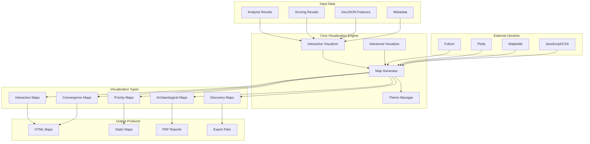

# Visualization System Documentation

## Overview

The Amazon Archaeological Discovery Pipeline Visualization System provides comprehensive interactive mapping, data visualization, and reporting capabilities for archaeological analysis results. This system transforms complex satellite data and detection results into intuitive, field-ready visualizations for researchers, archaeologists, and decision-makers.

## Architecture

### Core Design Principles

1. **Interactive Exploration**: Web-based interactive maps for detailed analysis
2. **Multi-Sensor Integration**: Unified visualization of GEDI, Sentinel-2, and combined results
3. **Archaeological Context**: Specialized visualizations for archaeological interpretation
4. **Performance Optimization**: Efficient rendering of large-scale detection results
5. **Export Capabilities**: Multiple output formats for different use cases
6. **Field-Ready Products**: Optimized for archaeological fieldwork planning

### System Components



## Core Visualization Classes

### `InteractiveArchaeologicalVisualizer` Class

#### Primary Interactive Mapping Engine

```python
class InteractiveArchaeologicalVisualizer:
    def __init__(self, results_dir: Path, run_id: str = None):
        """Initialize interactive archaeological visualizer.
        
        Args:
            results_dir: Base directory for visualization outputs
            run_id: Unique identifier for pipeline run
        """
        self.results_dir = results_dir
        self.run_id = run_id
        self.maps_dir = results_dir / f"run_{run_id}" / "maps" if run_id else results_dir / "maps"
        self.maps_dir.mkdir(parents=True, exist_ok=True)
        
        # Initialize visualization themes
        self.themes = self._load_archaeological_themes()
        
        # Performance settings
        self.max_features_per_layer = 1000
        self.enable_clustering = True
        self.cluster_radius = 50
```

#### Interactive Map Creation

```python
def create_interactive_map(self, analysis_results: Dict[str, List[dict]], 
                          output_path: Path, 
                          theme: str = "archaeological",
                          provider: str = None) -> Path:
    """Create comprehensive interactive archaeological map.
    
    Args:
        analysis_results: Detection results by zone
        output_path: Output file path for HTML map
        theme: Visualization theme ('archaeological', 'scientific', 'field')
        provider: Specific provider filter (optional)
        
    Returns:
        Path to generated interactive map
    """
    import folium
    from folium import plugins
    
    # Calculate map center from all features
    all_coordinates = self._extract_all_coordinates(analysis_results)
    if not all_coordinates:
        logger.warning("No coordinates found for map creation")
        return None
    
    center_lat = sum(coord[0] for coord in all_coordinates) / len(all_coordinates)
    center_lon = sum(coord[1] for coord in all_coordinates) / len(all_coordinates)
    
    # Create base map with archaeological theme
    archaeological_map = folium.Map(
        location=[center_lat, center_lon],
        zoom_start=self._calculate_optimal_zoom(all_coordinates),
        tiles=self.themes[theme]["basemap"],
        attr=self.themes[theme]["attribution"]
    )
    
    # Add archaeological features by provider
    for zone_id, zone_analyses in analysis_results.items():
        zone_group = folium.FeatureGroup(name=f"Zone: {zone_id}")
        
        for analysis in zone_analyses:
            if provider and analysis.get("provider") != provider:
                continue
                
            self._add_provider_features(
                archaeological_map, 
                zone_group, 
                analysis, 
                zone_id, 
                theme
            )
        
        zone_group.add_to(archaeological_map)
    
    # Add specialized archaeological layers
    self._add_archaeological_overlays(archaeological_map, analysis_results, theme)
    
    # Add interactive controls
    self._add_interactive_controls(archaeological_map)
    
    # Add legend and information panel
    self._add_archaeological_legend(archaeological_map, theme)
    
    # Save interactive map
    archaeological_map.save(str(output_path))
    
    logger.info(f"Created interactive archaeological map: {output_path}")
    return output_path

def _add_provider_features(self, map_obj, feature_group, analysis: Dict, zone_id: str, theme: str):
    """Add provider-specific features to map with archaeological styling."""
    
    provider = analysis.get("provider", "unknown")
    total_features = analysis.get("total_features", 0)
    
    if total_features == 0:
        return
    
    # Get provider-specific styling
    provider_style = self.themes[theme]["providers"][provider]
    
    # Process provider-specific results
    if provider == "gedi":
        self._add_gedi_features(map_obj, feature_group, analysis, provider_style)
    elif provider == "sentinel2":
        self._add_sentinel2_features(map_obj, feature_group, analysis, provider_style)
    
def _add_gedi_features(self, map_obj, feature_group, analysis: Dict, style: Dict):
    """Add GEDI LiDAR features with archaeological interpretation."""
    
    # Process clearing results
    clearing_results = analysis.get("clearing_results", {})
    gap_clusters = clearing_results.get("gap_clusters", [])
    
    for cluster in gap_clusters:
        coordinates = cluster.get("coordinates", [])
        if len(coordinates) != 2:
            continue
            
        confidence = cluster.get("confidence", 0.0)
        area_km2 = cluster.get("area_km2", 0.0)
        count = cluster.get("count", 0)
        
        # Archaeological interpretation
        if count >= 10:
            interpretation = "Major Settlement Complex"
            icon_color = "red"
        elif count >= 5:
            interpretation = "Village Settlement"
            icon_color = "orange"
        else:
            interpretation = "House/Garden Plot"
            icon_color = "yellow"
        
        # Create popup with archaeological context
        popup_html = f"""
        <div style="width: 300px;">
            <h4>🏛️ Archaeological Clearing</h4>
            <p><strong>Interpretation:</strong> {interpretation}</p>
            <p><strong>Evidence:</strong> {count} GEDI points below 15m canopy height</p>
            <p><strong>Area:</strong> {area_km2:.3f} km²</p>
            <p><strong>Confidence:</strong> {confidence:.1%}</p>
            <p><strong>Coordinates:</strong> {coordinates[0]:.4f}, {coordinates[1]:.4f}</p>
            <hr>
            <p><em>Detected via space-based LiDAR canopy gap analysis</em></p>
        </div>
        """
        
        # Add marker with archaeological styling
        folium.Marker(
            location=[coordinates[0], coordinates[1]],
            popup=folium.Popup(popup_html, max_width=350),
            tooltip=f"{interpretation} (Confidence: {confidence:.1%})",
            icon=folium.Icon(
                color=icon_color,
                icon="home",
                prefix="fa"
            )
        ).add_to(feature_group)
    
    # Process earthwork results
    earthwork_results = analysis.get("earthwork_results", {})
    
    # Add mound clusters
    for mound in earthwork_results.get("mound_clusters", []):
        coordinates = mound.get("coordinates", [])
        if len(coordinates) != 2:
            continue
            
        count = mound.get("count", 0)
        confidence = mound.get("confidence", 0.0)
        
        interpretation = "Major Mound Complex" if count >= 4 else "Individual Mound"
        
        popup_html = f"""
        <div style="width: 300px;">
            <h4>⛰️ Archaeological Earthwork</h4>
            <p><strong>Type:</strong> {interpretation}</p>
            <p><strong>Evidence:</strong> {count} elevation anomaly points</p>
            <p><strong>Confidence:</strong> {confidence:.1%}</p>
            <p><strong>Coordinates:</strong> {coordinates[0]:.4f}, {coordinates[1]:.4f}</p>
            <hr>
            <p><em>Detected via LiDAR elevation anomaly analysis</em></p>
        </div>
        """
        
        folium.Marker(
            location=[coordinates[0], coordinates[1]],
            popup=folium.Popup(popup_html, max_width=350),
            tooltip=f"{interpretation} (Confidence: {confidence:.1%})",
            icon=folium.Icon(
                color="brown",
                icon="mountain",
                prefix="fa"
            )
        ).add_to(feature_group)
    
    # Add linear features (causeways)
    for linear in earthwork_results.get("linear_features", []):
        coordinates_list = linear.get("coordinates", [])
        if len(coordinates_list) < 2:
            continue
            
        r2_score = linear.get("r2", 0.0)
        length_km = linear.get("length_km", 0.0)
        
        interpretation = "Ancient Causeway" if r2_score > 0.9 else "Linear Feature"
        
        # Create line feature
        folium.PolyLine(
            locations=[[coord[1], coord[0]] for coord in coordinates_list],  # [lat, lon]
            popup=f"""
            <div style="width: 250px;">
                <h4>🛤️ {interpretation}</h4>
                <p><strong>Length:</strong> {length_km:.2f} km</p>
                <p><strong>Linearity (R²):</strong> {r2_score:.3f}</p>
                <hr>
                <p><em>Detected via linear pattern analysis</em></p>
            </div>
            """,
            tooltip=f"{interpretation} ({length_km:.1f}km, R²={r2_score:.2f})",
            color="blue",
            weight=3,
            opacity=0.8
        ).add_to(feature_group)

def _add_sentinel2_features(self, map_obj, feature_group, analysis: Dict, style: Dict):
    """Add Sentinel-2 multispectral features with archaeological interpretation."""
    
    # Extract Sentinel-2 detection results
    sentinel2_analysis = analysis.get("sentinel2_analysis", {})
    
    # Process terra preta detections
    tp_detections = sentinel2_analysis.get("terra_preta_detections", {})
    tp_features = tp_detections.get("features", [])
    
    for feature_data in tp_features:
        coordinates = feature_data.get("coordinates", [])
        if len(coordinates) != 2:
            continue
            
        confidence = feature_data.get("confidence", 0.0)
        area_m2 = feature_data.get("area_m2", 0)
        ndvi = feature_data.get("ndvi", 0.0)
        tp_index = feature_data.get("terra_preta_index", 0.0)
        method = feature_data.get("method", "standard")
        
        # Archaeological interpretation based on area
        area_hectares = area_m2 / 10000
        if area_hectares >= 10:
            interpretation = "Major Agricultural Complex"
            icon_color = "green"
        elif area_hectares >= 1:
            interpretation = "Village Agricultural Area"
            icon_color = "lightgreen"
        else:
            interpretation = "Household Garden Plot"
            icon_color = "darkgreen"
        
        popup_html = f"""
        <div style="width: 300px;">
            <h4>🌱 Terra Preta Site</h4>
            <p><strong>Interpretation:</strong> {interpretation}</p>
            <p><strong>Area:</strong> {area_hectares:.2f} hectares</p>
            <p><strong>NDVI:</strong> {ndvi:.3f}</p>
            <p><strong>Terra Preta Index:</strong> {tp_index:.3f}</p>
            <p><strong>Detection Method:</strong> {method}</p>
            <p><strong>Confidence:</strong> {confidence:.1%}</p>
            <p><strong>Coordinates:</strong> {coordinates[0]:.4f}, {coordinates[1]:.4f}</p>
            <hr>
            <p><em>Detected via multispectral soil signature analysis</em></p>
        </div>
        """
        
        folium.Marker(
            location=[coordinates[0], coordinates[1]],
            popup=folium.Popup(popup_html, max_width=350),
            tooltip=f"{interpretation} ({area_hectares:.1f} ha, {confidence:.1%})",
            icon=folium.Icon(
                color=icon_color,
                icon="leaf",
                prefix="fa"
            )
        ).add_to(feature_group)
    
    # Process geometric pattern detections
    geometric_detections = sentinel2_analysis.get("geometric_detections", {})
    geometric_features = geometric_detections.get("features", [])
    
    for feature_data in geometric_features:
        coordinates = feature_data.get("coordinates", [])
        if len(coordinates) != 2:
            continue
            
        confidence = feature_data.get("confidence", 0.0)
        feature_type = feature_data.get("type", "geometric_pattern")
        area_m2 = feature_data.get("area_m2", 0)
        
        # Archaeological interpretation
        if feature_type == "circle":
            interpretation = "Plaza or Ring Village"
            icon = "circle"
        elif feature_type == "rectangle":
            interpretation = "Platform Mound or Structure"
            icon = "square"
        elif feature_type == "line":
            interpretation = "Field Boundary or Path"
            icon = "minus"
        else:
            interpretation = "Geometric Pattern"
            icon = "shapes"
        
        popup_html = f"""
        <div style="width: 300px;">
            <h4>📐 Geometric Feature</h4>
            <p><strong>Type:</strong> {interpretation}</p>
            <p><strong>Shape:</strong> {feature_type.title()}</p>
            <p><strong>Area:</strong> {area_m2:.0f} m²</p>
            <p><strong>Confidence:</strong> {confidence:.1%}</p>
            <p><strong>Coordinates:</strong> {coordinates[0]:.4f}, {coordinates[1]:.4f}</p>
            <hr>
            <p><em>Detected via geometric pattern recognition</em></p>
        </div>
        """
        
        folium.Marker(
            location=[coordinates[0], coordinates[1]],
            popup=folium.Popup(popup_html, max_width=350),
            tooltip=f"{interpretation} (Confidence: {confidence:.1%})",
            icon=folium.Icon(
                color="purple",
                icon=icon,
                prefix="fa"
            )
        ).add_to(feature_group)
```

### Enhanced Tooltip System

The visualization system provides comprehensive, coordinate-complete tooltips for all archaeological features:

#### Tooltip Standards
- **All tooltips include latitude and longitude coordinates** in format `{lat:.6f}, {lon:.6f}` (±0.11m accuracy)
- **Consistent formatting** across all detection types and data sources
- **Appropriate length** - essential information without overwhelming detail
- **Multi-sensor integration** for convergence analysis

#### Tooltip Types and Examples

**GEDI LiDAR Detection Tooltip**:
```html
<div class="popup-compact">
    <div class="popup-header">
        <span class="popup-title">🛰️ GEDI LiDAR Detection</span>
        <span class="confidence-badge gedi">80.0%</span>
    </div>
    <div class="popup-details">
        <p><strong>Coordinates:</strong> -12.288880, -53.077710</p>
        <p><strong>Area:</strong> 1,963 m² (0.20 ha)</p>
        <p><strong>Type:</strong> Gedi Clearing</p>
        <p><strong>LiDAR Shots:</strong> 15 (75.0 shots/ha)</p>
        <p><strong>Quality:</strong> High</p>
    </div>
</div>
```

**Sentinel-2 Detection Tooltip**:
```html
<div class="popup-compact">
    <div class="popup-header">
        <span class="popup-title">🌱 Sentinel-2 Detection</span>
        <span class="confidence-badge sentinel2">71.5%</span>
    </div>
    <div class="popup-details">
        <p><strong>Coordinates:</strong> -12.276120, -53.143860</p>
        <p><strong>Area:</strong> 14,300 m² (1.43 ha)</p>
        <p><strong>Type:</strong> Terra Preta Optimized</p>
        <p><strong>Data Source:</strong> ESA Sentinel-2</p>
    </div>
</div>
```

**Priority Investigation Site Tooltip**:
```html
<div class="feature-popup">
    <div class="popup-header priority-header">
        <h3>🚩 Priority Investigation Site #3</h3>
        <div class="priority-badge">HIGH PRIORITY</div>
    </div>
    <div class="popup-content">
        <div class="scientific-metrics">
            <h4>📊 Detection Metrics</h4>
            <p><strong>Coordinates:</strong> -12.276120, -53.143860</p>
            <p><strong>Confidence:</strong> 0.715 (71.5%)</p>
            <p><strong>Area:</strong> 1.43 hectares (14,300 m²)</p>
            <p><strong>Type:</strong> Terra Preta Optimized</p>
            <p><strong>Primary Sensor:</strong> Sentinel2</p>
        </div>
        <div class="validation-metrics">
            <h4>🎯 Cross-Provider Validation</h4>
            <p><strong>Validation Status:</strong> Single sensor</p>
            <p><strong>Convergent Score:</strong> 0.000</p>
        </div>
        <div class="field-investigation">
            <h4>🔬 Field Investigation</h4>
            <p><strong>Priority Rank:</strong> #3 of top candidates</p>
            <p><strong>Investigation Priority:</strong> High</p>
            <p><strong>Recommended Action:</strong> Immediate ground survey</p>
        </div>
    </div>
</div>
```

**Convergence Line Tooltip**:
```html
GEDI Detection: gedi_clearing<br/>
Coordinates: -12.226358, -53.149249<br/>
Correlated with Sentinel-2 at 552m
```

#### Coordinate Extraction Logic
The tooltip system uses comprehensive coordinate extraction with multiple fallbacks:

```python
# Extract coordinates with multiple fallbacks
lat, lon = 0.0, 0.0

# Try different coordinate sources
if 'coordinates' in raw_data:
    coords = raw_data['coordinates']
    if isinstance(coords, list) and len(coords) >= 2:
        lon, lat = coords[0], coords[1]

# Fallback to geometry if available
if (lat == 0.0 and lon == 0.0) and 'geometry' in raw_data:
    geom = raw_data['geometry']
    if isinstance(geom, dict) and 'coordinates' in geom:
        coords = geom['coordinates']
        if isinstance(coords, list) and len(coords) >= 2:
            lon, lat = coords[0], coords[1]

# Fallback to direct lat/lon fields
if lat == 0.0 and lon == 0.0:
    lat = raw_data.get('lat', 0.0)
    lon = raw_data.get('lon', 0.0)
```

### Archaeological Theme System

```python
def _load_archaeological_themes(self) -> Dict[str, Dict]:
    """Load predefined archaeological visualization themes."""
    
    return {
        "archaeological": {
            "name": "Archaeological Research",
            "basemap": "OpenStreetMap",
            "attribution": "Archaeological Discovery Pipeline",
            "color_scheme": {
                "clearings": "#FF6B6B",      # Red for settlements
                "earthworks": "#8B4513",     # Brown for earthworks
                "terra_preta": "#32CD32",    # Green for agricultural
                "geometric": "#9370DB",      # Purple for patterns
                "convergent": "#4169E1"      # Blue for multi-sensor
            },
            "providers": {
                "gedi": {
                    "color": "#FF6B6B",
                    "icon": "satellite",
                    "opacity": 0.8
                },
                "sentinel2": {
                    "color": "#32CD32", 
                    "icon": "leaf",
                    "opacity": 0.8
                }
            }
        },
        
        "scientific": {
            "name": "Scientific Analysis",
            "basemap": "CartoDB positron",
            "attribution": "CartoDB | Archaeological Analysis",
            "color_scheme": {
                "high_confidence": "#2E8B57",   # Dark green
                "medium_confidence": "#FFD700",  # Gold
                "low_confidence": "#FFA500",    # Orange
                "uncertainty": "#D3D3D3"       # Light gray
            },
            "providers": {
                "gedi": {
                    "color": "#2E8B57",
                    "icon": "crosshairs",
                    "opacity": 0.9
                },
                "sentinel2": {
                    "color": "#4169E1",
                    "icon": "eye",
                    "opacity": 0.9
                }
            }
        },
        
        "field": {
            "name": "Field Investigation",
            "basemap": "Esri.WorldImagery",
            "attribution": "Esri | Field Planning",
            "color_scheme": {
                "priority_1": "#DC143C",      # Crimson for highest priority
                "priority_2": "#FF8C00",      # Dark orange for medium
                "priority_3": "#FFD700",      # Gold for lower priority
                "investigated": "#808080"     # Gray for completed
            },
            "providers": {
                "gedi": {
                    "color": "#DC143C",
                    "icon": "flag",
                    "opacity": 1.0
                },
                "sentinel2": {
                    "color": "#FF8C00",
                    "icon": "flag",
                    "opacity": 1.0
                }
            }
        }
    }
```

### `AdvancedArchaeologicalVisualizer` Class

#### High-Performance Visualization Engine

```python
class AdvancedArchaeologicalVisualizer:
    def __init__(self, max_features: int = 10000):
        """Initialize advanced visualizer for large-scale datasets.
        
        Args:
            max_features: Maximum features to render for performance
        """
        self.max_features = max_features
        self.performance_mode = True
        self.clustering_enabled = True
        
    def create_convergence_analysis_map(self, 
                                      gedi_results: Dict[str, Any],
                                      sentinel2_results: Dict[str, Any],
                                      convergence_results: Dict[str, Any],
                                      output_path: Path) -> Path:
        """Create advanced convergence analysis visualization.
        
        Args:
            gedi_results: GEDI detection results
            sentinel2_results: Sentinel-2 detection results  
            convergence_results: Multi-sensor convergence analysis
            output_path: Output file path
            
        Returns:
            Path to generated convergence map
        """
        import folium
        from folium import plugins
        
        # Calculate convergence statistics
        convergence_stats = self._calculate_convergence_statistics(
            gedi_results, sentinel2_results, convergence_results
        )
        
        # Create base map centered on convergence hotspots
        center_coords = convergence_stats["hotspot_center"]
        convergence_map = folium.Map(
            location=[center_coords[0], center_coords[1]],
            zoom_start=12,
            tiles="CartoDB dark_matter"
        )
        
        # Add convergence heatmap layer
        self._add_convergence_heatmap(convergence_map, convergence_results)
        
        # Add individual sensor layers
        gedi_layer = self._create_gedi_layer(gedi_results)
        sentinel2_layer = self._create_sentinel2_layer(sentinel2_results)
        
        gedi_layer.add_to(convergence_map)
        sentinel2_layer.add_to(convergence_map)
        
        # Add convergence analysis overlays
        self._add_convergence_circles(convergence_map, convergence_results)
        self._add_confidence_zones(convergence_map, convergence_results)
        
        # Add advanced controls
        folium.LayerControl().add_to(convergence_map)
        
        # Add convergence statistics panel
        self._add_convergence_statistics_panel(convergence_map, convergence_stats)
        
        # Save map
        convergence_map.save(str(output_path))
        
        logger.info(f"Created convergence analysis map: {output_path}")
        return output_path
    
    def _add_convergence_heatmap(self, map_obj, convergence_results: Dict[str, Any]):
        """Add heatmap showing convergence density."""
        
        from folium import plugins
        
        # Extract convergence points
        convergence_points = []
        
        for zone_id, zone_convergence in convergence_results.items():
            convergent_features = zone_convergence.get("convergent_features", [])
            
            for feature in convergent_features:
                coordinates = feature.get("coordinates", [])
                confidence = feature.get("confidence", 0.5)
                
                if len(coordinates) == 2:
                    # Weight by confidence for heatmap intensity
                    convergence_points.append([
                        coordinates[0], coordinates[1], confidence
                    ])
        
        if convergence_points:
            # Create heatmap
            heatmap = plugins.HeatMap(
                convergence_points,
                name="Convergence Density",
                min_opacity=0.2,
                max_zoom=18,
                radius=25,
                blur=15,
                gradient={
                    0.2: "blue",
                    0.4: "cyan", 
                    0.6: "lime",
                    0.8: "yellow",
                    1.0: "red"
                }
            )
            heatmap.add_to(map_obj)
    
    def create_priority_investigation_map(self,
                                        top_candidates: List[Dict],
                                        accessibility_data: Dict[str, Any],
                                        output_path: Path) -> Path:
        """Create field investigation priority map.
        
        Args:
            top_candidates: Highest priority archaeological candidates
            accessibility_data: Access routes and logistics information
            output_path: Output file path
            
        Returns:
            Path to generated priority map
        """
        import folium
        from folium import plugins
        
        if not top_candidates:
            logger.warning("No candidates provided for priority map")
            return None
        
        # Calculate map center from candidates
        center_lat = sum(c["coordinates"][0] for c in top_candidates) / len(top_candidates)
        center_lon = sum(c["coordinates"][1] for c in top_candidates) / len(top_candidates)
        
        # Create base map for field planning
        priority_map = folium.Map(
            location=[center_lat, center_lon],
            zoom_start=11,
            tiles="Esri.WorldImagery"
        )
        
        # Add priority candidates with field investigation details
        for i, candidate in enumerate(top_candidates, 1):
            self._add_priority_candidate_marker(priority_map, candidate, i)
        
        # Add accessibility information
        self._add_accessibility_routes(priority_map, accessibility_data)
        
        # Add investigation planning tools
        self._add_investigation_tools(priority_map, top_candidates)
        
        # Add priority legend
        self._add_priority_legend(priority_map)
        
        # Save priority map
        priority_map.save(str(output_path))
        
        logger.info(f"Created priority investigation map: {output_path}")
        return output_path
    
    def _add_priority_candidate_marker(self, map_obj, candidate: Dict, rank: int):
        """Add priority candidate marker with field investigation details."""
        
        coordinates = candidate["coordinates"]
        confidence = candidate.get("confidence", 0.0)
        investigation_priority = candidate.get("investigation_priority", "medium")
        estimated_time = candidate.get("estimated_investigation_time", 1)
        access_difficulty = candidate.get("access_difficulty", "unknown")
        
        # Determine marker styling based on priority
        if investigation_priority == "high":
            color = "red"
            icon = "exclamation"
            size = "large"
        elif investigation_priority == "medium":
            color = "orange"  
            icon = "flag"
            size = "medium"
        else:
            color = "yellow"
            icon = "info"
            size = "small"
        
        # Create detailed popup for field planning
        popup_html = f"""
        <div style="width: 350px;">
            <h3>🎯 Priority Site #{rank}</h3>
            <p><strong>Investigation Priority:</strong> {investigation_priority.title()}</p>
            <p><strong>Archaeological Confidence:</strong> {confidence:.1%}</p>
            <p><strong>Estimated Investigation Time:</strong> {estimated_time} days</p>
            <p><strong>Access Difficulty:</strong> {access_difficulty.title()}</p>
            <p><strong>GPS Coordinates:</strong> {coordinates[0]:.5f}, {coordinates[1]:.5f}</p>
            
            <hr>
            <h4>📋 Field Investigation Notes</h4>
            <p><strong>Recommended Team Size:</strong> {candidate.get('recommended_team_size', '4-6 people')}</p>
            <p><strong>Required Equipment:</strong> {candidate.get('required_equipment', 'Standard archaeological kit')}</p>
            <p><strong>Best Season:</strong> {candidate.get('recommended_season', 'Dry season (June-September)')}</p>
            
            <hr>
            <h4>🔬 Archaeological Context</h4>
            <p><strong>Feature Type:</strong> {candidate.get('type', 'Archaeological feature')}</p>
            <p><strong>Contributing Sensors:</strong> {', '.join(candidate.get('providers', ['Unknown']))}</p>
            <p><strong>Evidence Strength:</strong> {candidate.get('evidence_strength', 'Medium')}</p>
        </div>
        """
        
        # Add marker with investigation details
        marker = folium.Marker(
            location=[coordinates[0], coordinates[1]],
            popup=folium.Popup(popup_html, max_width=400),
            tooltip=f"Priority #{rank}: {investigation_priority.title()} ({confidence:.1%})",
            icon=folium.Icon(
                color=color,
                icon=icon,
                prefix="fa"
            )
        )
        marker.add_to(map_obj)
        
        # Add investigation radius circle
        investigation_radius = 500  # 500m investigation radius
        folium.Circle(
            location=[coordinates[0], coordinates[1]],
            radius=investigation_radius,
            popup=f"Investigation Area (500m radius)",
            color=color,
            fillColor=color,
            fillOpacity=0.1,
            weight=2,
            dashArray="5, 5"
        ).add_to(map_obj)
```

### Specialized Visualization Methods

#### Multi-Sensor Convergence Visualization

```python
def create_multi_sensor_convergence_visualization(self,
                                                analysis_results: Dict[str, List[dict]],
                                                convergence_threshold_m: float = 100.0,
                                                output_path: Path = None) -> Path:
    """Create sophisticated multi-sensor convergence visualization.
    
    Args:
        analysis_results: Analysis results from multiple providers
        convergence_threshold_m: Distance threshold for convergence (meters)
        output_path: Output file path
        
    Returns:
        Path to generated convergence visualization
    """
    
    # Extract features from all providers
    all_features = self._extract_features_by_provider(analysis_results)
    
    # Perform spatial convergence analysis
    convergence_analysis = self._analyze_spatial_convergence(
        all_features, convergence_threshold_m
    )
    
    # Calculate convergence statistics
    convergence_stats = {
        "total_features": sum(len(features) for features in all_features.values()),
        "convergent_clusters": len(convergence_analysis["clusters"]),
        "multi_sensor_sites": len([c for c in convergence_analysis["clusters"] if len(c["providers"]) > 1]),
        "average_confidence": convergence_analysis["average_confidence"],
        "convergence_ratio": convergence_analysis["convergence_ratio"]
    }
    
    # Create base map
    center_coords = convergence_analysis["center_coordinates"]
    convergence_map = folium.Map(
        location=[center_coords[0], center_coords[1]],
        zoom_start=self._calculate_optimal_zoom_for_convergence(convergence_analysis),
        tiles="CartoDB positron"
    )
    
    # Add provider-specific feature layers
    for provider, features in all_features.items():
        provider_layer = folium.FeatureGroup(
            name=f"{provider.upper()} Features ({len(features)})"
        )
        
        for feature in features:
            self._add_provider_feature_to_convergence_map(
                provider_layer, feature, provider
            )
        
        provider_layer.add_to(convergence_map)
    
    # Add convergence clusters
    convergence_layer = folium.FeatureGroup(name="Multi-Sensor Convergence")
    
    for cluster in convergence_analysis["clusters"]:
        if len(cluster["providers"]) > 1:  # Only multi-sensor convergence
            self._add_convergence_cluster_visualization(
                convergence_layer, cluster, convergence_threshold_m
            )
    
    convergence_layer.add_to(convergence_map)
    
    # Add convergence statistics panel
    stats_html = f"""
    <div style="position: fixed; 
                top: 10px; right: 10px; width: 300px; 
                background-color: white; border: 2px solid #ccc; 
                border-radius: 5px; padding: 10px; 
                font-family: Arial, sans-serif; font-size: 12px;
                z-index: 9999;">
        <h4>🔍 Convergence Analysis</h4>
        <p><strong>Total Features:</strong> {convergence_stats['total_features']}</p>
        <p><strong>Convergent Clusters:</strong> {convergence_stats['convergent_clusters']}</p>
        <p><strong>Multi-Sensor Sites:</strong> {convergence_stats['multi_sensor_sites']}</p>
        <p><strong>Average Confidence:</strong> {convergence_stats['average_confidence']:.1%}</p>
        <p><strong>Convergence Ratio:</strong> {convergence_stats['convergence_ratio']:.1%}</p>
        <hr>
        <p><em>Threshold: {convergence_threshold_m}m</em></p>
    </div>
    """
    
    convergence_map.get_root().html.add_child(folium.Element(stats_html))
    
    # Add layer control
    folium.LayerControl(position='topleft', collapsed=False).add_to(convergence_map)
    
    # Save map
    if output_path is None:
        output_path = self.maps_dir / "multi_sensor_convergence.html"
    
    convergence_map.save(str(output_path))
    
    logger.info(f"Created multi-sensor convergence visualization: {output_path}")
    return output_path

def _add_convergence_cluster_visualization(self, layer, cluster: Dict, threshold_m: float):
    """Add convergence cluster with enhanced visualization."""
    
    center_coords = cluster["center_coordinates"]
    providers = cluster["providers"]
    features = cluster["features"]
    enhanced_confidence = cluster["enhanced_confidence"]
    
    # Create convergence circle
    folium.Circle(
        location=[center_coords[0], center_coords[1]],
        radius=threshold_m,
        popup=f"""
        <div style="width: 250px;">
            <h4>🎯 Multi-Sensor Convergence</h4>
            <p><strong>Providers:</strong> {', '.join(providers)}</p>
            <p><strong>Features:</strong> {len(features)}</p>
            <p><strong>Enhanced Confidence:</strong> {enhanced_confidence:.1%}</p>
            <p><strong>Convergence Radius:</strong> {threshold_m}m</p>
            <hr>
            <p><em>Multiple sensors detected features within {threshold_m}m radius</em></p>
        </div>
        """,
        tooltip=f"Convergence: {', '.join(providers)} ({enhanced_confidence:.1%})",
        color="#4169E1",
        fillColor="#4169E1",
        fillOpacity=0.3,
        weight=3
    ).add_to(layer)
    
    # Add center marker
    folium.Marker(
        location=[center_coords[0], center_coords[1]],
        tooltip=f"Convergence Center ({enhanced_confidence:.1%})",
        icon=folium.Icon(
            color="blue",
            icon="crosshairs",
            prefix="fa"
        )
    ).add_to(layer)
```

### Performance Optimization

#### Large Dataset Handling

```python
def create_performance_optimized_map(self,
                                   analysis_results: Dict[str, List[dict]],
                                   max_features: int = 1000,
                                   clustering_enabled: bool = True,
                                   output_path: Path = None) -> Path:
    """Create performance-optimized map for large datasets.
    
    Args:
        analysis_results: Analysis results (potentially large)
        max_features: Maximum features to display
        clustering_enabled: Enable marker clustering
        output_path: Output file path
        
    Returns:
        Path to generated optimized map
    """
    
    # Filter and prioritize features for performance
    prioritized_features = self._prioritize_features_for_display(
        analysis_results, max_features
    )
    
    # Calculate optimal map bounds
    bounds = self._calculate_map_bounds(prioritized_features)
    
    # Create optimized base map
    optimized_map = folium.Map(
        location=[bounds["center_lat"], bounds["center_lon"]],
        zoom_start=bounds["zoom_level"],
        tiles="CartoDB positron",
        prefer_canvas=True  # Performance optimization
    )
    
    if clustering_enabled:
        # Use marker clustering for performance
        marker_cluster = MarkerCluster(
            name="Archaeological Features",
            options={
                'spiderfyOnMaxZoom': True,
                'showCoverageOnHover': False,
                'zoomToBoundsOnClick': True,
                'maxClusterRadius': 50
            }
        )
        
        # Add features to cluster
        for feature in prioritized_features:
            marker = self._create_optimized_marker(feature)
            marker_cluster.add_child(marker)
        
        marker_cluster.add_to(optimized_map)
    else:
        # Add features individually
        for feature in prioritized_features:
            marker = self._create_optimized_marker(feature)
            marker.add_to(optimized_map)
    
    # Add performance statistics
    performance_info = f"""
    <div style="position: fixed; bottom: 10px; right: 10px; 
                background-color: rgba(255,255,255,0.9); 
                padding: 5px; border-radius: 3px; font-size: 11px;">
        Displaying {len(prioritized_features)} of {sum(len(analyses) for analyses in analysis_results.values())} features
    </div>
    """
    optimized_map.get_root().html.add_child(folium.Element(performance_info))
    
    # Save optimized map
    if output_path is None:
        output_path = self.maps_dir / "optimized_archaeological_map.html"
    
    optimized_map.save(str(output_path))
    
    logger.info(f"Created performance-optimized map: {output_path}")
    return output_path

def _prioritize_features_for_display(self, 
                                   analysis_results: Dict[str, List[dict]], 
                                   max_features: int) -> List[Dict]:
    """Prioritize features for display based on archaeological significance."""
    
    all_features = []
    
    # Extract and score all features
    for zone_id, zone_analyses in analysis_results.items():
        for analysis in zone_analyses:
            provider = analysis.get("provider", "unknown")
            total_features = analysis.get("total_features", 0)
            
            # Extract provider-specific features with scoring
            if provider == "gedi" and total_features > 0:
                features = self._extract_gedi_features_with_scores(analysis)
                all_features.extend(features)
            elif provider == "sentinel2" and total_features > 0:
                features = self._extract_sentinel2_features_with_scores(analysis)
                all_features.extend(features)
    
    # Sort by priority score (confidence + archaeological significance)
    all_features.sort(key=lambda x: x.get("priority_score", 0), reverse=True)
    
    # Return top features
    return all_features[:max_features]

def _create_optimized_marker(self, feature: Dict) -> folium.Marker:
    """Create optimized marker with minimal popup content for performance."""
    
    coordinates = feature["coordinates"]
    feature_type = feature.get("type", "Archaeological Feature")
    confidence = feature.get("confidence", 0.0)
    provider = feature.get("provider", "unknown")
    
    # Simplified popup for performance
    popup_content = f"""
    <div style="width: 200px;">
        <h5>{feature_type}</h5>
        <p><strong>Provider:</strong> {provider.upper()}</p>
        <p><strong>Confidence:</strong> {confidence:.1%}</p>
        <p><strong>Coords:</strong> {coordinates[0]:.4f}, {coordinates[1]:.4f}</p>
    </div>
    """
    
    # Simplified marker styling
    color_map = {
        "gedi": "red",
        "sentinel2": "green", 
        "convergent": "blue"
    }
    
    return folium.Marker(
        location=[coordinates[0], coordinates[1]],
        popup=folium.Popup(popup_content, max_width=250),
        tooltip=f"{feature_type} ({confidence:.1%})",
        icon=folium.Icon(
            color=color_map.get(provider, "gray"),
            icon="info-sign"
        )
    )
```

## Export and Report Integration

### Visualization Export System

```python
class VisualizationExportManager:
    def __init__(self, results_dir: Path, run_id: str):
        """Initialize visualization export manager."""
        self.results_dir = results_dir
        self.run_id = run_id
        self.maps_dir = results_dir / f"run_{run_id}" / "maps"
        self.maps_dir.mkdir(parents=True, exist_ok=True)
    
    def export_complete_visualization_suite(self,
                                          analysis_results: Dict[str, List[dict]],
                                          scoring_results: Dict[str, Dict[str, Any]]) -> Dict[str, Path]:
        """Export complete suite of archaeological visualizations.
        
        Args:
            analysis_results: Analysis results from pipeline
            scoring_results: Scoring results from convergent analysis
            
        Returns:
            Dict mapping visualization type to file path
        """
        
        export_paths = {}
        
        # 1. Interactive archaeological overview map
        overview_path = self.maps_dir / "archaeological_overview.html"
        interactive_viz = InteractiveArchaeologicalVisualizer(self.results_dir, self.run_id)
        export_paths["overview"] = interactive_viz.create_interactive_map(
            analysis_results, overview_path, theme="archaeological"
        )
        
        # 2. Scientific analysis map
        scientific_path = self.maps_dir / "scientific_analysis.html" 
        export_paths["scientific"] = interactive_viz.create_interactive_map(
            analysis_results, scientific_path, theme="scientific"
        )
        
        # 3. Field investigation priority map
        field_path = self.maps_dir / "field_priorities.html"
        top_candidates = self._extract_top_candidates(scoring_results, limit=20)
        advanced_viz = AdvancedArchaeologicalVisualizer()
        export_paths["field"] = advanced_viz.create_priority_investigation_map(
            top_candidates, {}, field_path
        )
        
        # 4. Multi-sensor convergence analysis
        convergence_path = self.maps_dir / "convergence_analysis.html"
        export_paths["convergence"] = advanced_viz.create_multi_sensor_convergence_visualization(
            analysis_results, convergence_threshold_m=100.0, output_path=convergence_path
        )
        
        # 5. Performance-optimized overview for large datasets
        optimized_path = self.maps_dir / "optimized_overview.html"
        export_paths["optimized"] = advanced_viz.create_performance_optimized_map(
            analysis_results, max_features=2000, output_path=optimized_path
        )
        
        # 6. Provider-specific maps
        for provider in ["gedi", "sentinel2"]:
            provider_path = self.maps_dir / f"{provider}_features.html"
            export_paths[f"{provider}_map"] = interactive_viz.create_interactive_map(
                analysis_results, provider_path, theme="archaeological", provider=provider
            )
        
        # Generate visualization summary
        export_paths["summary"] = self._generate_visualization_summary(export_paths)
        
        logger.info(f"Exported complete visualization suite: {len(export_paths)} visualizations")
        return export_paths
    
    def _generate_visualization_summary(self, export_paths: Dict[str, Path]) -> Path:
        """Generate HTML summary of all available visualizations."""
        
        summary_html = """
        <!DOCTYPE html>
        <html>
        <head>
            <title>Archaeological Discovery Visualization Suite</title>
            <style>
                body { font-family: Arial, sans-serif; margin: 20px; }
                h1 { color: #2E8B57; }
                .viz-grid { display: grid; grid-template-columns: repeat(auto-fit, minmax(300px, 1fr)); gap: 20px; }
                .viz-card { border: 1px solid #ddd; border-radius: 8px; padding: 15px; }
                .viz-card h3 { color: #4169E1; margin-top: 0; }
                .viz-link { display: inline-block; background: #32CD32; color: white; padding: 8px 16px; text-decoration: none; border-radius: 4px; }
                .viz-link:hover { background: #228B22; }
            </style>
        </head>
        <body>
            <h1>🏛️ Archaeological Discovery Visualization Suite</h1>
            <p>Complete visualization suite for Amazon archaeological discoveries.</p>
            
            <div class="viz-grid">
        """
        
        viz_descriptions = {
            "overview": {
                "title": "🗺️ Archaeological Overview",
                "description": "Interactive map showing all detected archaeological features with detailed interpretation."
            },
            "scientific": {
                "title": "🔬 Scientific Analysis",
                "description": "Scientific visualization with confidence-based styling and analytical tools."
            },
            "field": {
                "title": "🎯 Field Investigation Priorities", 
                "description": "Priority map for field investigation planning with logistics information."
            },
            "convergence": {
                "title": "🔍 Multi-Sensor Convergence",
                "description": "Advanced analysis showing spatial convergence between different sensors."
            },
            "optimized": {
                "title": "⚡ Performance-Optimized Overview",
                "description": "Optimized visualization for large datasets with clustering and filtering."
            },
            "gedi_map": {
                "title": "🛰️ GEDI LiDAR Features",
                "description": "Space-based LiDAR archaeological features from NASA GEDI satellite."
            },
            "sentinel2_map": {
                "title": "🌱 Sentinel-2 Multispectral Features", 
                "description": "Multispectral archaeological signatures from ESA Sentinel-2 satellite."
            }
        }
        
        for viz_type, path in export_paths.items():
            if viz_type in viz_descriptions and path.exists():
                desc = viz_descriptions[viz_type]
                relative_path = path.name
                
                summary_html += f"""
                <div class="viz-card">
                    <h3>{desc['title']}</h3>
                    <p>{desc['description']}</p>
                    <a href="{relative_path}" class="viz-link" target="_blank">Open Visualization</a>
                </div>
                """
        
        summary_html += """
            </div>
            
            <hr>
            <footer>
                <p><em>Generated by Amazon Archaeological Discovery Pipeline</em></p>
                <p>🚀 Powered by NASA GEDI and ESA Sentinel-2 satellite data</p>
            </footer>
        </body>
        </html>
        """
        
        summary_path = self.maps_dir / "visualization_summary.html"
        with open(summary_path, 'w') as f:
            f.write(summary_html)
        
        return summary_path
```

## Usage Examples

### Basic Visualization Creation

```python
from src.core.visualizers import InteractiveArchaeologicalVisualizer

# Initialize visualizer
visualizer = InteractiveArchaeologicalVisualizer(
    results_dir=Path("results"), 
    run_id="archaeological_survey_001"
)

# Create interactive archaeological map
map_path = visualizer.create_interactive_map(
    analysis_results=analysis_results,
    output_path=Path("results/archaeological_map.html"),
    theme="archaeological"
)

print(f"Interactive map created: {map_path}")
```

### Advanced Convergence Analysis

```python
from src.core.advanced_visualizers import AdvancedArchaeologicalVisualizer

# Initialize advanced visualizer
advanced_viz = AdvancedArchaeologicalVisualizer(max_features=5000)

# Create convergence analysis
convergence_map = advanced_viz.create_multi_sensor_convergence_visualization(
    analysis_results=combined_analysis_results,
    convergence_threshold_m=100.0,
    output_path=Path("results/convergence_analysis.html")
)

print(f"Convergence analysis created: {convergence_map}")
```

### Complete Visualization Suite Export

```python
# Export complete visualization suite
export_manager = VisualizationExportManager(
    results_dir=Path("results"),
    run_id="comprehensive_survey_001"
)

visualization_suite = export_manager.export_complete_visualization_suite(
    analysis_results=pipeline_results["analysis_results"],
    scoring_results=pipeline_results["scoring_results"]
)

print(f"Visualization suite exported:")
for viz_type, path in visualization_suite.items():
    print(f"  {viz_type}: {path}")
```

The Visualization System provides comprehensive, interactive, and field-ready visualizations that transform complex satellite data into actionable archaeological intelligence for researchers, archaeologists, and field investigation teams.